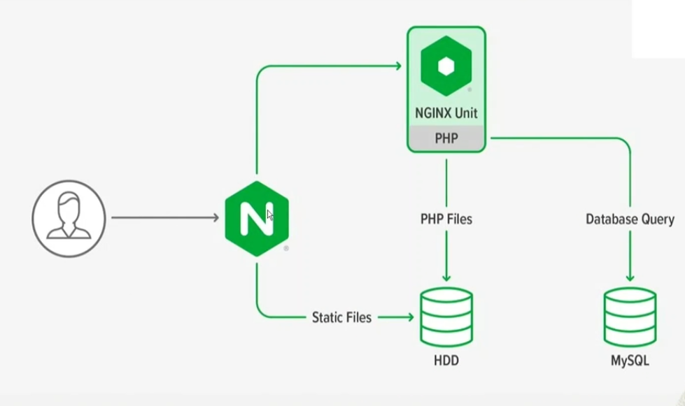
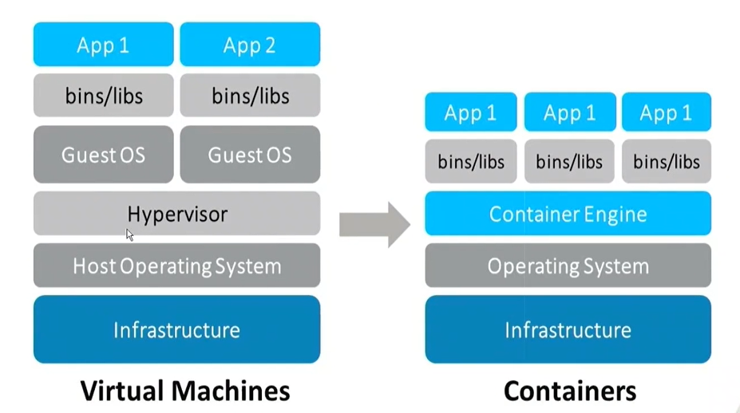
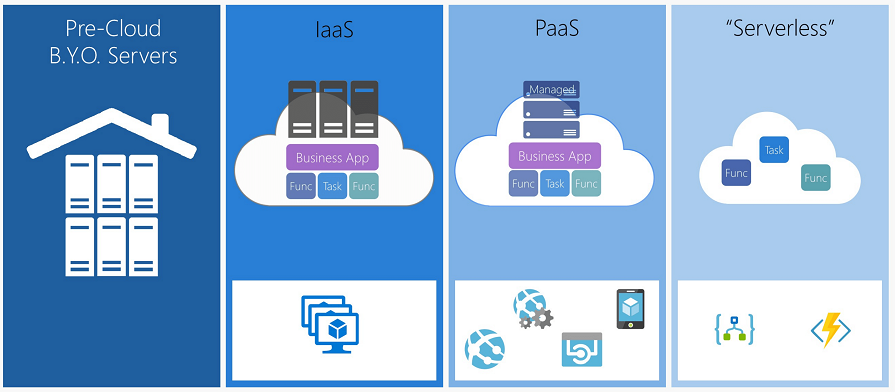

# **Fundamentos de HTML5 Módulo 2**

## **Aula 02 - Hospedagens e Servidores**

#### **Aula 2.A**

Um servidor é um sistema, físico ou virtual, que oferece serviços, recursos ou dados a outros dispositivos em uma rede, chamados clientes. Pode ser um hardware robusto projetado para processar e armazenar dados ou um software que gerencia tarefas específicas, como hospedagem de sites ou gerenciamento de e-mails. Servidores são essenciais para a comunicação e operação eficiente em redes, facilitando a troca de informações e o acesso a recursos compartilhados.

Um data center é uma instalação física projetada para abrigar servidores, equipamentos de rede e sistemas de armazenamento de dados. Esses centros são essenciais para gerenciar grandes volumes de informações e garantir a continuidade e a segurança dos serviços de TI. Um data center fornece infraestrutura crítica, como controle climático, energia redundante e sistemas de segurança, para garantir que os dados e aplicações estejam disponíveis e protegidos contra falhas e ameaças.

Hospedagem, no contexto de tecnologia e internet, refere-se ao serviço de armazenamento e gerenciamento de websites e dados na internet. Quando você "hospeda" um site, está utilizando um servidor, geralmente fornecido por uma empresa de hospedagem, para armazenar os arquivos do site e disponibilizá-los para acesso online. A hospedagem pode incluir diferentes tipos de serviços, como hospedagem compartilhada, VPS (Servidor Virtual Privado) e servidores dedicados, cada um oferecendo diferentes níveis de controle, desempenho e custo.

#### **Aula 2.B**

Conteúdo estático e dinâmico são dois tipos principais de conteúdo que um site pode exibir, e cada um tem características distintas:

1. **Conteúdo Estático** : É aquele que não muda frequentemente e é o mesmo para todos os visitantes. Normalmente, é composto por páginas HTML fixas e recursos como imagens e arquivos CSS. Uma vez criado, o conteúdo estático permanece o mesmo até que seja manualmente atualizado pelo desenvolvedor. Isso significa que a mesma página HTML é servida a todos os usuários sem alterações.
2. **Conteúdo Dinâmico** : É gerado em tempo real e pode variar com base em interações do usuário, dados do banco de dados ou outras variáveis. Por exemplo, um site de e-commerce que mostra produtos recomendados com base no histórico de navegação do usuário ou uma página de notícias que exibe artigos atualizados frequentemente. O conteúdo dinâmico é gerado por scripts ou aplicativos do servidor, como PHP, Python ou JavaScript, e é moldado pela interação com o banco de dados.

Enquanto o conteúdo estático é mais simples e rápido de carregar, o dinâmico oferece personalização e atualizações mais frequentes, proporcionando uma experiência mais interativa e atualizada para o usuário.

#### **Aula 2.B**

Um servidor web é um software que hospeda sites e entrega páginas web aos navegadores dos usuários na internet. Aqui está um resumo de como ele funciona:

1. **Recebimento da Solicitação** : Quando um usuário digita um URL em seu navegador ou clica em um link, o navegador faz uma solicitação HTTP ao servidor web. Essa solicitação inclui o endereço do recurso (como uma página web, imagem ou arquivo) que o usuário deseja acessar.
2. **Processamento da Solicitação** : O servidor web recebe a solicitação e interpreta o URL para identificar o recurso solicitado. Se o recurso solicitado é um arquivo estático, como uma página HTML ou uma imagem, o servidor simplesmente localiza o arquivo no seu sistema de arquivos.
3. **Geração de Conteúdo Dinâmico** : Se o recurso solicitado é dinâmico (como uma página que requer dados do banco de dados), o servidor web passa a solicitação para um aplicativo ou script de backend (por exemplo, PHP, Python, ou Node.js). Esse aplicativo processa a solicitação, interage com o banco de dados se necessário, e gera a resposta adequada.
4. **Envio da Resposta** : Depois de obter o recurso ou gerar a resposta dinâmica, o servidor web envia de volta a resposta ao navegador do usuário. Isso pode incluir o conteúdo da página web, imagens, arquivos CSS e JavaScript necessários.
5. **Exibição ao Usuário** : O navegador do usuário recebe a resposta do servidor web e renderiza a página para que o usuário possa visualizar e interagir com o conteúdo.

Essencialmente, um servidor web atua como intermediário entre os navegadores dos usuários e os recursos que eles desejam acessar, processando e entregando o conteúdo solicitado.

#### **Aula 2.C**

Servidor Web - Como funciona

Um servidor web é um software que entrega páginas e recursos da web aos navegadores dos usuários. Aqui está uma visão detalhada de como ele funciona:

1. **Recepção da Solicitação** : O processo começa quando um usuário faz uma solicitação para acessar um site. O navegador do usuário envia uma requisição HTTP (ou HTTPS) para o servidor web. Essa solicitação inclui o URL (Uniform Resource Locator) do recurso desejado.
2. **Resolução de URL** : O servidor web interpreta o URL para determinar qual recurso precisa ser fornecido. O URL pode apontar para um arquivo estático (como uma página HTML ou imagem) ou um script dinâmico (como um arquivo PHP ou uma aplicação web).
3. **Localização do Recurso** :
   * **Conteúdo Estático** : Se o recurso solicitado for um arquivo estático, o servidor localiza o arquivo no sistema de arquivos e o prepara para envio.
   * **Conteúdo Dinâmico** : Se o recurso for dinâmico, o servidor encaminha a solicitação para um script ou aplicativo de backend, que pode interagir com bancos de dados ou realizar cálculos para gerar o conteúdo solicitado.
4. **Geração de Conteúdo Dinâmico** : O aplicativo de backend (como um script PHP, uma aplicação em Python, ou um servidor de Node.js) processa a solicitação, acessa dados necessários (por exemplo, consultar um banco de dados), e gera a resposta apropriada.
5. **Formatação da Resposta** : O servidor web formata a resposta para o formato adequado (HTML, JSON, XML, etc.) e inclui informações adicionais como cabeçalhos HTTP que fornecem metadados sobre a resposta.
6. **Envio da Resposta** : O servidor envia a resposta ao navegador do usuário. Se o recurso é um arquivo estático, ele é entregue diretamente. Para conteúdo dinâmico, o servidor envia a saída gerada pelo backend.
7. **Renderização no Navegador** : O navegador do usuário recebe a resposta do servidor e a renderiza para exibir a página web. Se houver recursos adicionais, como arquivos CSS ou JavaScript, o navegador pode fazer solicitações adicionais ao servidor para obtê-los.
8. **Manejo de Sessões e Cookies** : Durante a interação, o servidor pode também gerenciar sessões e cookies para manter informações entre as solicitações e oferecer uma experiência personalizada ao usuário.

Em resumo, um servidor web atua como o intermediário entre o navegador do usuário e o conteúdo desejado, processando solicitações e enviando respostas para exibir páginas da web e recursos relacionados.

## **Aula 03 - Tipos de Servidores**

#### **Aula 3.A**

**Servidor Compartilhado** : Vários sites compartilham os mesmos recursos (CPU, memória, espaço em disco) em um único servidor. É a opção mais econômica, ideal para sites pequenos com baixo tráfego. O desempenho pode ser afetado por outros sites no mesmo servidor.

**Servidor Dedicado** : Um servidor exclusivo para um único usuário ou site, oferecendo todos os recursos para esse uso. Proporciona melhor desempenho e controle, mas é mais caro. Ideal para sites de alto tráfego e aplicações críticas.

**Servidor Virtual Privado (VPS)** : Divide um servidor físico em múltiplas instâncias virtuais independentes com recursos alocados. Oferece mais controle e desempenho que o compartilhado, a um custo intermediário. Ideal para projetos que precisam de mais recursos e personalização.

## **Aula 04 - Principais softwares de servidores web**

#### **Aula 4.B**

O **Servidor Apache** , ou **Apache HTTP Server** , é um dos servidores web mais amplamente utilizados globalmente, conhecido por sua robustez e flexibilidade. Desenvolvido pela Apache Software Foundation, ele serve como uma plataforma de hospedagem para sites e aplicações web, processando solicitações HTTP e HTTPS com eficiência. A modularidade do Apache permite que os administradores adicionem ou removam módulos conforme necessário, ajustando o servidor para suportar uma ampla variedade de tecnologias e requisitos específicos.

Sua configuração é altamente personalizável através de arquivos como `httpd.conf` e `.htaccess`, oferecendo controle detalhado sobre a segurança, o acesso e o desempenho. Além disso, o Apache é compatível com diversos sistemas operacionais e é capaz de otimizar seu desempenho através de diferentes módulos de processamento, tornando-o uma escolha popular tanto para pequenas quanto para grandes implementações web.

#### **Aula 4.C**

O **Nginx** foi criado por Igor Sysoev em 2004 como uma solução para lidar com a crescente demanda de tráfego na web, especialmente em sites de alto tráfego. Desde seu lançamento, o Nginx se destacou por sua eficiência e capacidade de gerenciar grandes volumes de conexões simultâneas, tornando-se uma escolha popular para empresas e sites que exigem alta performance e escalabilidade. Sua arquitetura de processamento assíncrono e baseado em eventos permite que ele manipule milhares de conexões simultâneas com baixo uso de recursos.

Conhecido por sua leveza e rapidez, o Nginx funciona tanto como servidor web quanto como proxy reverso e balanceador de carga. Ele é amplamente adotado por sua capacidade de oferecer alta disponibilidade e desempenho superior, especialmente em ambientes de alta demanda. A configuração do Nginx é feita através de arquivos simples e diretos, facilitando a gestão e personalização. A combinação de desempenho eficiente e flexibilidade tornou o Nginx uma escolha popular para grandes sites e serviços na web.

#### **Aula 4.D**

O **Internet Information Services (IIS)** é um servidor web desenvolvido pela Microsoft, com sua primeira versão lançada em 1995. Inicialmente projetado para o sistema operacional Windows NT, o IIS evoluiu ao longo dos anos para se integrar profundamente com o ecossistema Windows Server, oferecendo suporte a tecnologias web da Microsoft, como ASP.NET e .NET Core. Sua integração com outras ferramentas Microsoft, como o Active Directory e o SQL Server, facilita o gerenciamento e a implementação de aplicações empresariais.

O IIS é conhecido por sua interface gráfica de administração intuitiva, que permite configurar e gerenciar facilmente sites e aplicativos. Ele oferece recursos avançados como balanceamento de carga, cache de conteúdo, e segurança robusta através de suporte a autenticação e criptografia. Com suporte a extensões e módulos, o IIS pode ser personalizado para atender a uma ampla variedade de necessidades, tornando-o uma solução eficaz para ambientes empresariais que utilizam o ecossistema Microsoft.

#### **Aula 4.E**

O **LiteSpeed** é um servidor web de alto desempenho criado pela LiteSpeed Technologies, lançado inicialmente em 2003. Desenvolvido para ser uma alternativa eficiente e leve aos servidores web tradicionais, o LiteSpeed oferece recursos avançados de cache e segurança, com foco em otimizar a velocidade de carregamento de sites e reduzir a carga no servidor. Sua versão comercial, LiteSpeed Enterprise, inclui funcionalidades adicionais, como suporte a PHP otimizado e integração com o sistema de gerenciamento de conteúdo WordPress.

O LiteSpeed é conhecido por sua arquitetura de processamento baseado em eventos, que permite manipular um grande número de conexões simultâneas com baixo uso de memória. Além disso, o servidor possui uma interface de administração intuitiva e é compatível com as configurações do Apache, facilitando a migração de sites e a integração com sistemas existentes. Suas características de desempenho e segurança o tornam uma escolha popular para sites e aplicações que exigem alta velocidade e proteção robusta.

#### **Aula 4.F**

**Express.js** é um framework minimalista e flexível para Node.js, criado por TJ Holowaychuk e lançado em 2010. Ele foi projetado para simplificar o desenvolvimento de aplicações web e APIs, oferecendo uma camada de abstração sobre o Node.js para facilitar o roteamento e a manipulação de requisições HTTP. Express tornou-se um dos frameworks mais populares para Node.js devido à sua simplicidade e à vasta gama de funcionalidades que proporciona para construir aplicações robustas e escaláveis.

Express se destaca por sua configuração leve e modular, permitindo aos desenvolvedores adicionar middleware para gerenciar tarefas como autenticação, validação de dados e processamento de solicitações. A sua flexibilidade é uma das suas principais características, permitindo que os desenvolvedores escolham outras bibliotecas e ferramentas que se ajustem às suas necessidades. Com uma vasta comunidade e uma ampla gama de módulos e extensões disponíveis, o Express.js continua a ser uma escolha predominante para o desenvolvimento de aplicações web modernas.

## **Aula 05 - Containers**

#### **Aula 5.A**

Um **container** é uma tecnologia que permite empacotar uma aplicação e todas as suas dependências em um único pacote isolado. Isso garante que a aplicação funcione de maneira consistente, independentemente do ambiente onde é executada, seja no desenvolvimento, teste ou produção.

##### Características Principais dos Containers:

1. **Isolamento** : Containers oferecem um ambiente isolado para a aplicação, permitindo que ela opere de forma independente dos outros processos e aplicações no mesmo sistema. Isso minimiza conflitos e garante que as dependências específicas da aplicação não interfiram em outras.
2. **Portabilidade** : Como os containers incluem todas as dependências necessárias, eles podem ser executados em diferentes ambientes, como diferentes sistemas operacionais e plataformas de nuvem, sem precisar de modificações.
3. **Leveza** : Containers são mais leves que máquinas virtuais (VMs) porque compartilham o mesmo núcleo do sistema operacional subjacente, em vez de virtualizar todo o sistema operacional. Isso resulta em menos uso de recursos e tempos de inicialização mais rápidos.
4. **Consistência** : Eles garantem que o ambiente de execução seja consistente, desde o desenvolvimento até a produção, ajudando a evitar problemas relacionados ao "funciona na minha máquina".
5. **Escalabilidade** : Containers facilitam a escalabilidade horizontal, permitindo que várias instâncias da aplicação sejam executadas simultaneamente e escaladas conforme a demanda, sem complexidade adicional.

##### Exemplos de Tecnologias de Containers:

* **Docker** : A plataforma de containers mais popular, que fornece ferramentas e uma infraestrutura para criar, gerenciar e orquestrar containers.
* **Kubernetes** : Um sistema de orquestração de containers que automatiza a implantação, o gerenciamento e a escalabilidade de containers em ambientes de produção.

Em resumo, containers são uma solução eficiente para empacotar e distribuir aplicações de forma consistente e portátil, promovendo agilidade no desenvolvimento e operações de TI.

#### **Aula 5.B**

**Serverless** é um modelo de computação em nuvem que permite aos desenvolvedores construir e executar aplicações sem se preocupar com a gestão da infraestrutura do servidor. Apesar do nome, o modelo não significa que não há servidores envolvidos, mas sim que a administração dos servidores é abstraída do desenvolvedor e gerenciada pelo provedor de nuvem.

##### Características Principais do Serverless:

1. **Abstração da Infraestrutura** : O provedor de nuvem cuida da infraestrutura, incluindo servidores e sistemas operacionais, permitindo que os desenvolvedores se concentrem apenas na lógica da aplicação.
2. **Escalabilidade Automática** : As funções serverless escalam automaticamente em resposta à demanda. Isso significa que o provedor de nuvem gerencia a alocação de recursos conforme necessário, sem intervenção manual.
3. **Cobrança por Uso** : Em vez de pagar por servidores ou instâncias que ficam ativos o tempo todo, você paga apenas pelo tempo de execução das suas funções e pelos recursos consumidos, o que pode resultar em economia de custos.
4. **Desenvolvimento Baseado em Funções** : No modelo serverless, o código é dividido em funções independentes que são executadas em resposta a eventos, como chamadas HTTP, atualizações de banco de dados ou mensagens de fila.
5. **Facilidade de Implementação** : As plataformas serverless, como AWS Lambda, Azure Functions e Google Cloud Functions, oferecem ferramentas e integrações que simplificam a implementação e o gerenciamento de funções.

##### Exemplos de Plataformas Serverless:

* **AWS Lambda** : Oferece execução de código em resposta a eventos, com suporte para várias linguagens de programação.
* **Azure Functions** : Permite a criação e execução de funções na nuvem, integrando-se com outros serviços do Azure.
* **Google Cloud Functions** : Fornece um ambiente de execução para funções de backend em resposta a eventos do Google Cloud.

O modelo serverless é ideal para aplicações com cargas de trabalho variáveis e para cenários onde a eficiência e a agilidade no desenvolvimento são prioridades.
