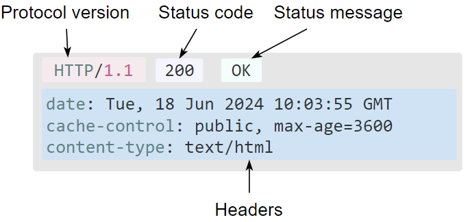
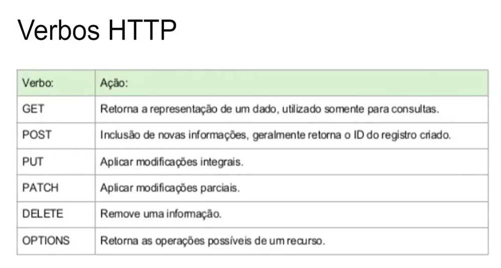

# Fundamentos de HTML5 Módulo 1

#### Aula 2.A

A Advanced Research Projects Agency Network (acrônimo ARPANET; em português: Rede da Agência para Projetos de Pesquisa Avançada) foi uma rede de computadores construída em 1969 para transmissão de dados militares sigilosos e interligação dos departamentos de pesquisa nos Estados Unidos

LAN -  Local Area Network ou área de rede local, é um grupo de dispositivos de computação conectados em uma área localizada que geralmente compartilha uma conexão centralizada com a internet.

WAN - Wide Area Networks ou rede de longa distância como tecnologia para a transmissão dos dados.

#### Aula 2.B

Utilização dos cabos para criação da rede de Internet.

Neste processo para realizar a modificação dos sinais para melhor compatibilidade e transcrição das informações do computador para o moldem (sinal digital transmitido do computador para o moldem) e do moldem para os cabos (sinal analógico transmitido por linha de telefone), transformando sinal digital para sinal analógico chamando esse processo de Modulação e Demodulação.

Os moldem possibilitam que em qualquer lugar do mundo que queira implementar um servidor ou um cliente queira acessar a internet ou adicionar informações para que outras possam acessar essas informações.

TCP/IP é um conjunto de protocolos que possibilita a comunicação entre computadores e servidores, formando a Internet. Ele combina o Protocolo de Controle de Transmissão (TCP), responsável pela transmissão de dados, com o Protocolo de Internet (IP), que identificar os computadores e servidores. O TCP é usado em conjunto com o IP para manter a conexão entre o remetente e o destinatário e para garantir a ordem dos pacotes. O IP é um protocolo sem conexão, ou seja, cada unidade de dados é individualmente endereçada e direcionada do dispositivo de origem para o dispositivo de destino, que não envia uma confirmação de recebimento à origem.

A criação do HTML e do protocolo HTTP criado pelo laboratório de pesquisa revolucionou a forma de como as informações poderiam ser digitadas e transmitidas criando a WWW. World Wide Web (Rede Mundial de Computadores) designa um sistema de documentos em hipermídia (ou hipermédia) que são interligados e executados na Internet.

#### Aula 2.C

Tim Berners-Lee é conhecido como o ‘Pai da Internet’ por sua criação da World Wide Web, que
permitiu que pessoas em todo o mundo compartilhassem documentos e informações.
Ele o ofereceu a qualquer pessoa sem patentes e não recebeu royalties por ele,
portanto, não lucrou com sua invenção. No artigo Information Management: A
Proposal de 1989.

"Hipertexto" refere-se aos links que conectam páginas da Web entre
si, seja dentro de um único site ou entre sites. Links são um aspecto
fundamental da web. Ao carregar conteúdo na Internet e vinculá-lo a páginas
criadas por outras pessoas, você se torna um participante ativo na world wide
web.

HTML (Linguagem de
Marcação de HiperTexto) é o bloco de construção mais básico da web. Define o
significado e a estrutura do conteúdo da web.

O Hypertext Transfer
Protocol, sigla HTTP é um protocolo que permite a obtenção de recursos, como
documentos HTML. É a base de qualquer troca de dados na Web e um protocolo
cliente-servidor, o que significa que as requisições são iniciadas pelo
destinatário, geralmente um navegador da Web.

#### Aula 2.D

O primeiro site
criado:

[http://info.cern.ch/](http://info.cern.ch/)

#### Aula 2.E

WEB

## Aula 03 - HTTP

#### Aula 3.A

#### Aula 3.B

#### Aula 3.C

As requisições
consistem dos seguintes elementos:

* Um método HTTP, geralmente é
  um verbo como GET, POST, DELETE, PUT, etc, ou um substantivo como OPTIONS
  ou HEAD que define qual operação o cliente quer fazer. Tipicamente, um
  cliente quer pegar um recurso (usando GET) ou publicar dados de um
  formulário HTML (usando POST), embora mais operações podem ser necessárias
  em outros casos.
* O caminho do recurso a ser
  buscado; a URL do recurso sem os elementos que são de contexto, por
  exemplo sem o protocolo protocol (http://), o domínio domain (aqui como
  developer.mozilla.org), ou a porta port TCP (aqui indicada pelo 80 que é
  ocultado por ser o número da porta padrão)
* A versão do protocolo HTTP.
* Cabeçalhos opcionais que
  contém informações adicionais para os servidores.
* Ou um corpo de dados, para
  alguns métodos como POST, similares aos corpos das respostas, que contém o
  recurso requisitado.

#### Aula 3.D

Respostas consistem
dos seguintes elementos:

* A versão do protocolo HTTP
  que elas seguem.
* Um código de status,
  indicando se a requisição foi bem sucedida, ou não, e por quê.
* Uma mensagem de status, uma
  pequena descrição informal sobre o código de status.
* Cabeçalhos HTTP, como aqueles
  das requisições.
* Opcionalmente, um corpo com
  dados do recurso requisitado.

#### Aula 3.E

#### Aula 3.F

## Aula 04 - Camadas da Internet

#### Aula 4.A

#### Aula 4.B

DNS

#### Aula 4.C

TCP/IP transmissão
de dados

Sempre que algo é enviado pela internet, como uma mensagem, uma foto ou um
arquivo, o modelo TCP/IP divide os dados em pacotes de acordo com um
procedimento de quatro camadas. Os dados passam primeiro por essas camadas em
uma ordem e, em seguida, na ordem inversa, à medida que os dados são remontados
no receptor.

#### Aula 4.D

Deep Web: É uma zona
da internet que não pode ser detectada facilmente pelos tradicionais motores de
busca, garantindo privacidade e anonimato para os seus navegantes. Ela é
formada por um conjunto de sites, fóruns e comunidades que costumam debater
temas de caráter ilegal e imoral ou que deseja navegar de maneira anonima. Na
Deep Web, os endereços parecem mais com senhas de alta segurança do que com
sites tradicionais, garantindo anonimato e dificultando o rastreio direto à
fonte das informações3. Além disso, a Deep Web pode ser usada para acessar
conteúdos censurados por governos locais e para a liberdade de expressão e
informação.

## Aula 05 - Navegadores

#### Aula 5.A

Um navegador, também
conhecido como browser, é um software que permite acessar e exibir páginas da
web. Ele funciona como uma interface entre o usuário e a internet,
interpretando as informações dos sites e exibindo-as de forma visualmente
agradável e interativa.

#### Aula 5.B

O primeiro navegador
foi o WorldWideWeb, desenvolvido por Tim Berners-Lee em 1990. Ele foi criado
com o objetivo de permitir o acesso e a navegação na World Wide Web, que na
época era uma coleção de documentos interligados. O objetivo de Berners-Lee era
facilitar o compartilhamento de informação e promover a colaboração entre
pesquisadores, acadêmicos e profissionais, dando origem ao que hoje conhecemos
como a internet.

Esse navegador só
rodava no sistema Next e depois foi criado o Nexus com a interface gráfica
devido ter mais sistemas e melhoria da interface gráfica, mostrando arquivos
como se fosse somente o HTML.

Logo depois foi criado o Mosaic sendo o primeiro navegador com interface
gráfica mais robusta  estando mais
próximo dos navegadores atuais.

#### Aula 5.C

O Mosaic foi um dos
primeiros navegadores de internet amplamente utilizado. Foi desenvolvido em
1993 por uma equipe liderada por Marc Andreessen na National Center for
Supercomputing Applications (NCSA) na universidade de Ilinoi, nos Estados
Unidos.

O Mosaic foi o
primeiro navegador a popularizar o conceito de navegação por meio de imagens e
links, oferecendo uma experiência mais visual e intuitiva para os
usuários.

O navegador permitia a exibição de imagens, texto formatado e hiperlinks, o que
possibilitava a navegação entre diferentes páginas e sites.

Embora o Mosaic
tenha sido substituído por navegadores mais avançados, como o Netscape
Navigator e o Internet Explorer, ele teve um papel crucial na popularização da
internet e na evolução da forma como navegamos na web hoje em dia.

O Netscape Navigator
foi lançado em 1994 pela Netscape Communications Corporation, fundada por Marc
Andreessen e Jim Clark. Foi uma peça fundamental na popularização da internet e
do comércio eletrônico. Os recursos inovadores para a época, como suporte a
imagens, tabelas e frames, além de oferecer uma experiência mais visual e
interativa. Sendo pioneiro na introdução de recursos como os cookies, que
permitiam aos sites armazenar informações no computador dos usuários, e os
plugins, que possibilitavam a execução de conteúdo multimídia, como vídeos e
animações.

No entanto,
enfrentou forte concorrência com o lançamento do Internet Explorer pela
Microsoft, o que resultou em uma "guerra dos navegadores". Com a
competição acirrada e a falta de inovação e recursos levaram ao declínio do
Netscape Navigator. A empresa Netscape foi adquirida pela AOL em 1998 e,
posteriormente, o código-fonte do navegador foi disponibilizado como software
livre e em 2007 foi descontinuado, dando origem ao projeto Mozilla, que deu
continuidade ao desenvolvimento do navegador Firefox.

#### Aula 5.D

O Projeto Mozilla
foi lançado em 1998 e atraiu uma comunidade de desenvolvedores apaixonados que
contribuíram para o desenvolvimento do navegador. Em 2002, o Mozilla 1.0 foi
lançado como o primeiro grande lançamento do navegador.

No entanto, a
Mozilla Foundation foi criada como uma organização sem fins lucrativos em 2003
para liderar o desenvolvimento do navegador e promover a missão de garantir que
a internet permaneça aberta e acessível a todos. A fundação lançou o navegador
Firefox como o sucessor do Mozilla, e o Firefox rapidamente ganhou popularidade
como uma alternativa mais rápida e segura aos navegadores existentes.

O Firefox introduziu
recursos inovadores, como a navegação por abas, bloqueador de pop-ups e
extensões personalizáveis, que permitiam aos usuários adicionar funcionalidades
extras ao navegador. Além disso, a Mozilla Foundation também se comprometeu com
os padrões abertos da web e a privacidade do usuário.

A Mozilla Foundation
também expandiu suas atividades para além do navegador, desenvolvendo produtos
como o Thunderbird (cliente de e-mail) e o Firefox OS (sistema operacional para
dispositivos móveis).

Hoje, a Mozilla
continua a ser uma organização líder na defesa da web aberta e no
desenvolvimento de tecnologias de código aberto. O Firefox continua a ser um
dos navegadores mais populares do mundo, com uma base de usuários fiel e um
compromisso contínuo com a privacidade e a segurança online.

#### Aula 5.E

Ao longo dos anos, o
Firefox continuou a evoluir, trazendo melhorias de desempenho, recursos
avançados de segurança e privacidade, além de uma interface de usuário moderna.

O Phoenix,
posteriormente renomeado para Mozilla Firefox, é um navegador de código aberto
desenvolvido pela Mozilla Foundation. Ele foi criado em 2002 como um projeto
para oferecer uma experiência de navegação mais leve e rápida. Com recursos
como a navegação por abas e suporte a extensões, o Firefox ganhou popularidade
por sua velocidade, segurança e seu compromisso com a web aberta e a
privacidade do usuário. Hoje, o Firefox é amplamente utilizado, com uma
comunidade ativa de desenvolvedores e uma base de usuários fiel.

#### Aula 5.F

O Internet Explorer
é um navegador desenvolvido pela Microsoft e lançado em 1995. Foi um dos
navegadores mais populares por muitos anos, sendo o navegador padrão do sistema
operacional Windows. O Internet Explorer trouxe recursos como navegação por
abas, suporte a tecnologias web e integração com outros produtos da Microsoft.
No entanto, nas últimas décadas, o Internet Explorer perdeu parte de sua
popularidade devido a problemas de segurança e falta de inovação, sendo
substituído pelo Microsoft Edge como navegador principal da Microsoft.

#### Aula 5.G

O Microsoft Edge é um navegador desenvolvido pela Microsoft, lançado em 2015 como sucessor do Internet Explorer. Com foco em desempenho, segurança e compatibilidade com os padrões web, o Edge apresenta recursos como navegação por abas, suporte a extensões, integração com serviços da Microsoft e um design moderno. Ele se tornou o navegador padrão do Windows 10, oferecendo uma experiência de navegação rápida, eficiente e com recursos avançados de privacidade.

#### Aula 5.H

O Opera é um navegador web desenvolvido pela empresa norueguesa Opera Software. Com
lançamento em 1995, o Opera oferece recursos como navegação por abas, bloqueador de anúncios embutido, economia de dados, VPN integrada e personalização avançada. Ele é conhecido por sua velocidade, eficiência e suporte a tecnologias web inovadoras. Além disso, o Opera possui uma interface amigável e uma comunidade ativa de usuários, tornando-se uma opção popular entre aqueles que buscam uma experiência de navegação completa e personalizável.

#### Aula 5.I

O Safari é um navegador desenvolvido pela Apple, lançado em 2003. Ele é o navegador padrão nos dispositivos da Apple, como iPhones, iPads e Macs. O Safari é conhecido por sua velocidade, eficiência e integração perfeita com o ecossistema da Apple. Oferece recursos como navegação por abas, bloqueador de anúncios, modo de leitura, suporte a extensões e recursos avançados de privacidade. O Safari se destaca por sua interface elegante, alto desempenho e recursos exclusivos, proporcionando uma experiência de navegação completa para os usuários da Apple.

#### Aula 5.J

O Google Chrome é um navegador desenvolvido pelo Google, lançado em 2008. Ele se tornou um dos navegadores mais populares devido à sua velocidade, simplicidade e integração com serviços do Google. O Chrome oferece recursos como navegação por abas, sincronização de dados entre dispositivos, suporte a extensões, modo de navegação anônima e um gerenciador de senhas. Além disso, o navegador é conhecido por ser altamente personalizável, permitindo aos usuários ajustarem as configurações de acordo com suas preferências. Com uma interface amigável e atualizações regulares, o Google Chrome continua a ser uma opção confiável e amplamente utilizada para a navegação na web.
