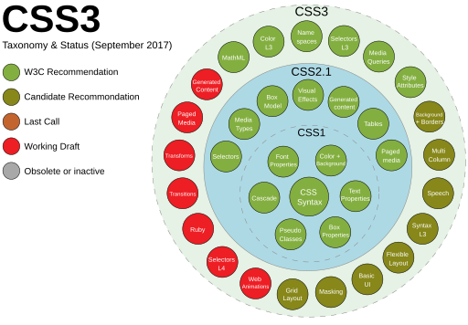

## Aula 02 - Sintaxe

#### Aula 2.A

**1996** : A W3C (World Wide Web Consortium) publicou o CSS1, a primeira versão do CSS. Introduziu propriedades básicas para estilização de texto e layout, permitindo separar o conteúdo do design.

**1998** : O CSS2 foi lançado, expandindo as capacidades do CSS1. Incluía suporte para posicionamento absoluto, z-index, e mídia, como impressão, além de melhorias no layout e suporte para fontes.

**2001** : O CSS2.1 começou a ser desenvolvido como uma atualização ao CSS2, visando corrigir erros e melhorar a consistência. Tornou-se um padrão oficial em 2011.

**2011** : Iniciou-se o desenvolvimento do CSS3, que foi dividido em módulos para facilitar o avanço gradual. CSS3 trouxe muitos novos recursos, incluindo seletores avançados, gradientes, sombras, bordas arredondadas, e animações.

**2012** : A introdução do "flexbox" no CSS3 revolucionou a maneira como layouts complexos podem ser construídos, facilitando a criação de designs responsivos e flexíveis.

**2014** : O CSS Grid Layout foi publicado como parte do CSS3, oferecendo uma abordagem poderosa e flexível para criar layouts de página mais complexos e responsivos.

**2016** : O CSS4 começou a ser desenvolvido, mas, ao invés de uma nova versão, muitas das propostas foram incorporadas nas atualizações contínuas do CSS3. O foco continuou na evolução gradual e adição de novos recursos.

O CSS está em constante evolução, com novos recursos sendo adicionados em ciclos contínuos. A comunidade de desenvolvedores continua a trabalhar em melhorias e novas especificações para atender às necessidades emergentes do design web.
