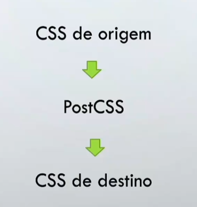

# **CSS Avançado: Estruturas e Boas Práticas**

## **Introdução**
Este material aborda conceitos avançados de CSS e suas extensões, como pré-processadores, pós-processadores e técnicas modernas de estilização. O conteúdo é destinado a desenvolvedores que desejam aprimorar suas habilidades, criar projetos mais eficientes e explorar ferramentas inovadoras que complementam o CSS puro. Desde a introdução de variáveis até o uso de tecnologias como Styled Components e Web Components, este guia fornece uma visão prática e abrangente.

---
## **Índice**

1. [**Aula 02 - Apresentação do Curso**](#aula-02---apresentação-do-curso)  
2. [**Aula 03 - Processadores CSS**](#aula-03---processadores-css)  
3. [**Aula 04 - SASS**](#aula-04---sass)  
4. [**Aula 05 - Pós CSS**](#aula-05---pós-css)  
5. [**Aula 06 - Componentes Estilizados**](#aula-06---componentes-estilizados)  
6. [**Aula 07 - Módulos CSS**](#aula-07---módulos-css)  
7. [**Aula 08 - Web Components e CSS**](#aula-08---web-components-e-css)  
8. [**Aula 09 - Google Mobile**](#aula-09---google-mobile)  
 

## **Aula 02 - Apresentação do Curso**

#### **Aula 2.A**

**CSS AVANÇADO**

* Pré-processadores CSS, como SASS e LESS
* Variáveis, Loopings, Funções e operações para Pré- processadores CSS.
* PostCSS
* Shadow DOM
* Styled Components
* CSS Modules

## **Aula 03 - Processadores CSS**

#### **Aula 3.A**

**Introdução - CSS**

O Cascading Style Sheets (CSS) é uma "folha de estilo" composta por "camadas" e utilizada para definir apresentação (aparência) em páginas da internos adotam para o seu desenvolvimento linguagens de  marcação (como XML HTML e XHTML).

**Pré-processadores CSS**

* CSS não possui o dinamismo e alguns recursos de Ruby, Python ou JavaScript.
* A falta de dinamismo deixa nosso código extenso e repetitivo.
* Existem linguagens intermediárias, os pré-processadores, que adicionam recursos para criar estilos com menos código.
* São interpretadores de código.
* Permitem gerar CSS a partir de um arquivo de outra sintaxe, conforme o pré-processador utilizado.
* Leem todo o código gerado e convertem para CSS (podendo ser minificado, se assim estiver definido).
* Possuem funcionalidades que não existe no CSS puro, como herança por exemplo.
* Bons exemplos são:
  * LESS
  * Sass
  * Stylus
* Eles tem semelhanças, logo vale a pena identificar qual agrada mais e qual irá atender melhor sua demand

#### **Aula 3.B**

**Vantagens:**

* Maioria permite a criação de Variáveis, Condicionais, Repetição, Imports/Extends, Funções e Mixins.
* Facilitam a manutenção do código.
* Permite um código limpo.
* Códigos CSS flexíveis e reutilizáveis.
* Linguagem/estrutura de melhor entendimento para pessoas e "menos" para a máquina.

**Desvantagens:**

* Aumento de complexidade em relação ao CSS puro.
* Devido a este aumento de complexidade, aumenta também a chance de baixo desempenho.

#### **Aula 3.C**

**LESS**

* É um pré-processador de CSS.
* Amplia a capacidade do CSS e que compila mais rápido que outros pré processadores.
* É baseado em JavaScript (não precisa conhecer a linguagem).
* Reduz redundância de código.
* Usado por várias empresas e frameworks, como o Bootstrap.
* Permite o uso de variáveis, funções, cálculos e hierarquia.
* Site: Lesscss.org
* Instalação no NodeJs: npm install less
  * Não é obrigatório, pois também funciona sem a instalação.

#### **Aula 3.D**

**Arquivo HTML**

* `<link rel="stylesheet/less" type="text/css" href="styles.css" />`
* A parte importante do link é o stylesheet/less onde faz a definição do processamento.
* `href="styles.css"` pode ser também `href="styles.less"`
* https://lesscss.org/

#### **Aula 3.E**

**Variáveis**

* Usa o @
  * Exemplo: @cor
* E ao invés de utilizar Uma determinado valor, você usa a variável criada.
* Facilita a mudança de propriedades do CSS de forma mais dinâmica e rápida.

#### **Aula 3.F**

**Hierarquia**

* Pode ser usado de forma mais intuitiva, colocando um dentro do outro:

```
p{
    color: @cor;
    b{
        color: @cor2;
    }
}
```

#### **Aula 3.G**

**Função**

* Permite a manipulação de valores a partir de uma lista de funções predefinidas pelo LESS.
* Permite transformar um valor noutro, manipular condicionais, fazer cálculos, etc.
* Site: https://lesscss.org/functions/

#### **Aula 3.I**

**Mixins**

* Usado quando há itens iguais em mais de um seletor e acaba usando a mesma estrutura de função.
* E como criar "funtions" dentro do CSS, com passagem ou não de parâmetros.
* Possibilita uso de valores padrão.
* Evita repetições.
  Função:

```
h1 {
    .drop-shadow();
    color: red;
}

.drop-shadow(){
    text-shadow: 2px 1px 1px #ccc;
    text-decoration: underline;
}
```

#### **Aula 3.J**

#### **Aula 3.K**

**Condições/lf**

Pode ser usado para fazer alguma condição de cores para tratar um valor padrão.

```
& when (@color = ") {
    color: darkgreen;
}else{
    color: @color;
}
```

#### **Aula 3.L**

**Math**

* Ao fazer uma configuração, a definição de um estilo, você poder fazer cálculos para definir padrões/proporcionalidades.
* Funciona também com cores.
* Opções: + - * /
* Devido às versões do Less, em algumas o/não funcionalidade a não ser que force o ./ que está obsoleto atualmente

#### **Aula 3.M**

Arquivos LESS são uma extensão do CSS que permitem usar variáveis, funções e outros recursos avançados para escrever folhas de estilo de maneira mais eficiente e organizada. No entanto, erros podem ocorrer durante a escrita ou compilação de arquivos LESS.

* Use uma ferramenta de linting: Ferramentas como lesshint podem ajudar a identificar erros e problemas de estilo.
* Consulte a documentação: A documentação oficial do LESS é uma ótima fonte para entender a sintaxe e os recursos disponíveis.
* Verifique o console de erros: A maioria dos compiladores LESS fornece mensagens de erro detalhadas que podem ajudar a identificar e corrigir problemas.

#### **Aula 3.N 3.O 3.P**

Os exercicio e o servido em Node.js não foram realizados devido não ser realizado o cursos de JavaScript.

## **Aula 04 - SASS**

#### **Aula 4.A**

**SASS**

* Sass é Uma extensão de CSS que empodera o CSS básico.
* É um pré-processador de CSS, assim como o Less.
* Permite o uso de variáveis, funções, cálculos e hierarquia.
* É uma Gem do Ruby, ou seja, uma biblioteca escrita em Ruby.
* Site: https://sass-lang.com/

#### **Aula 4.B**

**SASS**

* Exemplos de conversores online:
  - https://isonformatter.org/scss-to-css
  - https://codebeautify.org/sass-to-css-converter
* Plug-in Live Sass Compiler para VSCode.
* Estes são exemplos, pode usar outros conforme desejar
* Instalação da extenção:
  - Name: Live Sass Compiler
  - Id: glenn2223.live-sass
  - Description: Compile Sass or Scss to CSS at realtime.
  - Version: 6.1.2
  - Publisher: Glenn Marks
  - VS Marketplace Link: https://marketplace.visualstudio.com/items?itemName=glenn2223.live-sass

#### **Aula 4.C**

* Para variável se usa o $ e não o conforme outras linguagens.
* Permite usar os formatos .sass e .scss.

  * .scss é mais parecido com a sintaxe do CSS e LESS e é a que usaremo

    $cor: red;
    .item{
    color: $cor;
    }

    * .sass é mais parecido com a sintaxe do Pug, ou seja, sem abertura.

      $cor: red;
      .item
      color: $cor;

#### **Aula 4.D**

* Para funções, usamos o @mixin para a declaração

  @mixin fundoP($color) {
  backg round -color:$color;
  }

  * Na chamada usamos o @include

    .tipo {
    @include fundoP($cor);
    }

#### **Aula 4.E**

**Hierarquia**


* Pode ser usado de forma mais intuitiva, colocando um dentro do outro.

  .tipo {
  @include fundoP($cor2);
  a{
  color: $cor;
  }
  }

#### **Aula 4.F**

**Import*** É possível fazer o uso de imports:

* @use 'base';
* @import 'base'; / *este está em desuso
* Ao contrário das importações de CSS simples, que exigem que o navegador faça varias solicitações HTTP à medida que renderiza sua página, aqui importa tudo de uma vez, visto que irá se tornar só um arquivo CSS.

#### **Aula 4.G**

**Operadores/Math**

* ```>, >=, <, <= ==``` e ```!= ``` para comparações.
* ```+, -, *``` e ``` /``` para números.
* ```+``` para concatenar strings.
* Exemplos:

  1 + 2 * 3 == 1 + (2 * 3) // true

  * true or false and false == true or (false and false) // true

    ((1 + 2)* 3 + 4) * 5; // 65

#### **Aula 4.H**

**Remover aspas de uma string**

* ```#{$variável + 1}```
* Cria uma string sem aspas
* Se for usar como número, pode não funcionar, pois apesar de parecer um número não é.
* Se for para transformar em número, use $number * 1 px.

#### **Aula 4.I**

**Repetição/For/Looping**

* É possível o há um padrão de repetição entre alguma configuração:
* Exemplo:

  $cor: red;

  @for $i from 1 through 3 {
  $nome: 'tipo' + $i;
  #{$nome} {
  background-color: lighten($cor, $i * 5%);
  }
  }

#### **Aula 4.J**

**Vamos criar um projeto:**

* Você pode usar uma página sua como base, criando uma cópia.
* Sugiro Usar algum plug-in, como segunda opção, o NodeJs.
* Se já tiver um CSS, pode convertê-lo para SASS.
* Obrigatório usar variáveis, mixins, cálculos, looping e hierarquia.

## **Aula 05 - Pós CSS**

#### **Aula 5.A**

**POSTCSS**

* E um ecossistema de plugins personalizados e de ferramentas.
* Existe mais de 200 plugins e é possível criar mais.
* Pode ser usado com pré ou pós processador.
* Como pós processador, você não terá muito controle do que será feito, diferente do que é feito com o Less ou Sass.



#### **Aula 5.B**

Exemplo:

* Entrada:

  p{
  display: flex;
  }

  * Saída:

    p{
    display: -webkit-box;
    display: -ms-flexbox;
    display: flex;
    }

#### **Aula 5.C**

* É uma ferramenta para transformas CSS com JavaScript.
* No desenvolvimento podemos usar conceitos já apresentados neste  curso, visando evitar repetição de código, reuso, código limpo, organizada de fácil manutenção.
* Podemos usá-lo através de linha de comando ou taskrunners.
* É sempre importante consultar as documentações para entender e tirar o melhores benefícios.
* https://github.com/iedmao/postcss-middleware
* NodeJs

  * npm install postcss-middleware
* https://github.com/postcss/postcss
* https://www.postcss.parts/
* https://postcss.org/

#### **Aula 5.D**

* Exemplos de plug-ins
  * PostCSS Brazilian Portuguese Stylesheets
    * https://www.npmis.com/package/postcss-brazilian-portuguese-stylesheets
    * Permite a programação em português e processa para CSS.
  * Autoprefixer
    * https;//github.com/postcss/autoprefixer#browsers
    * https://autoprefixer.github.io/
    * Usado pela Google e Twitter, por exemplo
    * Usa dados do https://caniuse.com/ para aplicar regras atualizadas.
  * StyleLint
    * https://stylelint.io/
    * Valida e revisa códigos CSS, evitando erros

## **Aula 06 - Componentes Estilizados**

#### **Aula 6.A**

**STYLED COMPONENTS**

* É uma biblioteca para React/React Native que permite uso de estivos a nível  de componentes.
* É baseado em JavaScript com CSS.
* Documentação: https://styled-components.com/docs

#### **Aula 6.B**

**Principais vantagens:**

* Evita erros de nome de classe.
* Exclusão mais fácil de CSS: se excluir um componente não usado, todos seus estilos filhos também são excluídos juntos. Além disso há ferramenta para detectar se o componente é ou não usado.
* Fácil manutenção.

#### **Aula 6.C**

**Instalação:**

* YARN
  * yarn add styled-components
* NPM
  * install create-react-app
  * Criação de projeto:
  * init react-app my-app
  * create-react-app my-app
* Instalação do Styled-components
  * npm install styled-components
* Iniciar a aplicação:
  * npm start

#### **Aula 6.D**

**Exemplo de uso:**
import styled from 'styled-components';
const Title = styled.h1'
color: red;
';

<Title>Página 01 </Title>

Realizado a criação de um app simples chamado my-app.

#### **Aula 6.E**

Realizado a criação de um app simples chamado my-app-2.

Para melhor compreender os conceitos foi realizado os cursos abaixo.

* [NPM](https://www.youtube.com/watch?v=g-V5qptW2oo&list=PLbV6TI03ZWYVjruiKLeb3m2rEXeYsG6RQ)

* [React](https://www.youtube.com/watch?v=mXuxPrs6oHE&list=PLbV6TI03ZWYVIiHL5XBvefrVwhcLo7XYN)

#### **Aula 6.F**

Vamos dar continuidade ao nosso projeto:
- Criar um projeto com 5 páginas, simulando um site.
- Utilizar Styled Components além de CSS num arquivo separado.
- Tratar usabilidade e boas práticas.

Exercício realizado e hospedado no link:[Travel](https://github.com/Germano-Silva/Start_Capgemini/tree/main/Start%20By%20Capgemini/03_Trilha_Java/02_CSS3/02%20-%20CSS%20avan%C3%A7ado/Aula_06/travel)

## **Aula 07 - Módulos CSS**

#### **Aula 7.A**

  É um processo que ocorre no processo de build, que alteram o nome de classes e seletores para ter escopo local.
  ```JavaScript
  import styles from "./styles.css";
  element.innerHTML = <h1 class= "${styles.title}"> Titulo Exemplo </h1>
  ```
  ```HTML
  <h1 class= "styles_title_XPT0123"> Titulo Exemplo </h1>
  ```
  Geralmente feito por JavaScript.
  Exemplos: 
  [Bootstrap](https://getbootstrap.com/docs/5.3/getting-started/introduction/)
  [Jest](https://iestis.io/pt-BR/docs/webpack).

  Vem para sanar problemas como dependências, eliminação de código morto e classes globais.
  E mais vantajoso em projetos grandes.
  Projetos pequenos pode aumentar a complexidade de forma de desnecesária.

#### **Aula 7.B**
Criado um projeto node e react basico.
Modificado o nome do arquivo App.css para App.module.css.
Após isso será necessario modificar o arquivo App.js configurando a importação.
```JavaScript
import estilo from App.module.css
```
Depois desse processo tera que modificar todas as classe pois as mesmas estarão em formato hash convertendo as classes em uma sequência fixa de caracteres.

Com base nisso foi realizado as seguintes modificações:
```JavaScript
import logo from './logo.svg';
import estilo from'./App.module.css';

function App() {
  return (
    // utilizando o modulo css para estilizar o componente quando a classe não possuí "-" no nome.
    <div className={estilo.App}>
      {/* utilizando o modulo css para estilizar o componente quando a classe possuí "-" no nome. */}
      <header className={estilo["App-header"]}>
        
        <p>
          Edit <code>src/App.js</code> and save to reload.
        </p>
        <a
          className={estilo["App-link"]}
          href="https://reactjs.org"
          target="_blank"
          rel="noopener noreferrer"
        >
          Learn React
        </a>
      </header>
    </div>
  );
}

export default App;
```

Desta maneira podemos utilizar diversos modulos feitos com o mesmo nome de classe que não vai interferir na estilização da pagina caso não seja feito a troca do modulo impotado.

#### **Aula 7.C**

**STYLED COMPONENTS VS CSS MODULES.**

Se você gosta de usar/programar em CSS e/ou se manter um pouco mais conservador, a sugestão é usar CSS Modules.
Na prática, é quase o mesmo CSS puro, porém terá o escopo adicinal exceto nos casos que deixar a definição de escopo global.
Caso não queira e/ou não goste e/ou simplesmente decida não usar CSS, o Styled Components é uma ótima opção
Com ele não terá mais os arquivos .css. Usa tudo com JavaScript.

## **Aula 08**

#### **Aula 8.A**

**Web Components e CSS**

Web Components são uma tecnologia que permite criar elementos HTML personalizados com funcionalidades e estilos encapsulados, utilizando três pilares principais: **Custom Elements**, **Shadow DOM** e **HTML Templates**. No contexto de CSS, os Web Components oferecem recursos fundamentais para isolar e organizar estilos, evitando conflitos em projetos maiores.

**Conceitos Importantes**

**1. Encapsulamento de Estilo com Shadow DOM**  
O Shadow DOM cria um ambiente isolado dentro do componente, garantindo que os estilos internos não vazem para o restante da página e vice-versa. Isso possibilita o desenvolvimento de componentes reutilizáveis sem interferir no design global do site.

**2. Personalização com Variáveis CSS**  
Embora os estilos internos sejam encapsulados, os Web Components podem utilizar variáveis CSS (custom properties) para permitir personalizações externas, mantendo a flexibilidade no design.

**3. Escalabilidade e Organização**  
Web Components ajudam a estruturar estilos de forma modular, sendo ideais para sistemas de design, bibliotecas de componentes e aplicações que exigem separação de responsabilidades no código.

**4. Compatibilidade com Frameworks CSS**  
Por serem isolados, os Web Components permitem integrar frameworks CSS sem o risco de conflitos de classe ou estilos entre diferentes partes de um projeto.

Essa abordagem modular facilita a manutenção e a escalabilidade, sendo uma solução poderosa para equipes que trabalham em projetos complexos ou colaborativos.

[Documentação](https://developer.mozilla.org/pt-BR/docs/Web/API/Web_components)

#### **Aula 8.B**

**CUSTOM ELEMENTS**

- É formado por APIs JavaScript, as quais permite definir elementos customizados.
- Permite que selam criadas Tag diferentes das convencionais.
- Evita os alinhamentos de Divs, os temidos Div Hells.
- Possibilita criar elementos personalizados herdando características de algum já existente.

[Documentação](https://developer.mozilla.org/pt-BR/docs/Web/Web_Components/Using_custom_elements)

Exemplo de codigo que será utilizado para custom elements.
```JavaScript
class meuCompnente extends HTMLElement {
    constructor() {
        super();
        // Cria um shadow DOM para o componente
        this.root = this.attachShadow({ mode: 'open' });
    }

    connectedCallback() {
        // Define o template HTML e CSS do componente
        const template = `
        <style>
            :host {
                color: darkblue;
            }
        </style>
        <slot> Ola Mundo! </slot>
        `;

        // Adiciona o template ao shadow DOM
        this.root.innerHTML = template;
    }
}
```

#### **Aula 8.C**

**Shadow DOM**

O **Shadow DOM** é uma tecnologia fundamental do **Web Components** que permite criar um escopo isolado para elementos HTML, proporcionando encapsulamento total de estilo e comportamento. Ao utilizar o Shadow DOM, desenvolvedores podem definir um "DOM sombra" para um elemento, que é separado do DOM principal, criando uma barreira que impede que estilos globais ou scripts externos afetem seu conteúdo interno. Isso é especialmente útil para criar componentes reutilizáveis, como botões, modais ou widgets, garantindo que eles funcionem de forma previsível, independentemente do ambiente em que são inseridos.

O encapsulamento do Shadow DOM inclui:
- **Estilos isolados**: CSS definido dentro do Shadow DOM não interfere nem é afetado por estilos externos.
- **Estrutura DOM encapsulada**: O conteúdo interno não pode ser acessado diretamente do DOM principal, protegendo sua implementação.
- **Shadow Root**: O ponto de entrada para criar e gerenciar o Shadow DOM, ativado por métodos como `attachShadow`.

Existem dois modos de Shadow DOM:
- **Aberto (`open`)**: Permite que o script externo acesse o Shadow DOM via JavaScript.
- **Fechado (`closed`)**: Restringe completamente o acesso ao Shadow DOM, garantindo maior segurança.

O Shadow DOM melhora a modularidade e escalabilidade de aplicações web, tornando-o uma ferramenta poderosa para bibliotecas modernas e frameworks baseados em componentes, como React ou Vue, que integram conceitos semelhantes.

[Documentação](https://developer.mozilla.org/en-US/docs/Web/API/Web_components/Using_shadow_DOM)

#### **Aula 8.D**

**TEMPLATES**

- É formado por APIs JavaScript, as quais permite definir elementos  customizados.
- Permite a criação de Slots, o que dá mais flexibilidade ao códigos

Arquivo.js
```JavaScript
<div class="info">
  <p>Cargo: <slot name="cargo"/></p>
  <p>Experiencia: <slot name="xp" /></p>
  <p>Idiomas: <slot name="idiomas"/></p>
<div>
```

Arquivo.html
```HTML
<span slot="cargo">Estagiário</span>
<span slot="xp">6 meses</span>
<span slot="idiomas">Espanhol e Inglês</span>

```
**Templates e slots** são recursos essenciais no desenvolvimento de Web Components para criar estruturas de HTML reutilizáveis e flexíveis. O elemento `<template>` permite definir um fragmento de HTML que não é renderizado até ser explicitamente usado via JavaScript, proporcionando eficiência e separação de estrutura e comportamento. Já os `<slot>`s são utilizados para criar áreas dinâmicas nos componentes, onde o conteúdo pode ser inserido externamente, permitindo personalização sem alterar a estrutura interna. Esses recursos combinam modularidade e reutilização, tornando a construção de interfaces mais escalável e adaptável.

[Documentação](https://developer.mozilla.org/en-US/docs/Web/API/Web_components/Using_templates_and_slots)


## **Aula 09 - Google Mobile**

#### **Aula 9.A**

**PÁGINAS GOOGLE DE VERIFICAÇÃO** 

Google Mobile Friendly
search.google.com/test/mobile-friendly

A **Google Mobile-Friendly Test** é uma ferramenta oferecida pelo Google para verificar se uma página da web é otimizada para dispositivos móveis. Ela analisa a experiência do usuário ao acessar o site em smartphones e tablets, considerando fatores como:

**Finalidades da ferramenta:**

1. **Avaliar a compatibilidade móvel:**  
  A ferramenta ajuda a verificar se o design e a estrutura do site funcionam bem em dispositivos móveis, como celulares e tablets.

2. **Melhorar o ranqueamento nos resultados de busca:**  
  O Google prioriza páginas "mobile-friendly" no ranking de resultados de busca, especialmente em pesquisas feitas por dispositivos móveis. Portanto, passar no teste pode melhorar a visibilidade do site.

3. **Identificar problemas técnicos:**  
  O teste destaca problemas como:
  - Texto muito pequeno.
  - Elementos clicáveis muito próximos.
  - Conteúdo que não se ajusta à tela.
  - Uso de tecnologias desatualizadas, como Flash.

4. **Proporcionar uma melhor experiência ao usuário:**  
  Um site otimizado para dispositivos móveis é mais rápido, acessível e fácil de navegar, o que melhora a satisfação dos visitantes.

5. **Planejar melhorias no design responsivo:**  
  A ferramenta oferece insights para ajudar os desenvolvedores a ajustarem o layout e o design do site para atender aos critérios de responsividade.

### **Como usar:**
1. Acesse o site oficial da ferramenta: [Google Mobile-Friendly Test](https://search.google.com/test/mobile-friendly).
2. Insira o URL da página que deseja testar.
3. Aguarde o diagnóstico, que incluirá um resumo da análise e sugestões de melhorias, caso necessário.

Essa ferramenta é essencial para desenvolvedores front-end, para garantir que os sites em que está trabalhando atendam aos padrões modernos de usabilidade e SEO.

#### **Aula 9.B**

**Google Page Speed Tools**

O **Google PageSpeed Insights** é uma ferramenta oferecida pelo Google que analisa o desempenho de páginas da web, tanto em dispositivos móveis quanto em desktops. Ele mede a velocidade de carregamento, avalia a experiência do usuário e oferece sugestões de melhorias para otimizar o desempenho do site.  

**O que a ferramenta faz?**

1. **Avaliação de desempenho:**  
  Fornece uma pontuação de 0 a 100, baseada em dados de laboratório e do mundo real (usando o Chrome User Experience Report).  
  - **90+**: Excelente  
  - **50-89**: Precisa de melhorias  
  - **<50**: Ruim  

2. **Análise de Core Web Vitals:**  
  O relatório inclui as métricas principais de desempenho, chamadas de **Core Web Vitals**, que medem a experiência real dos usuários:  
  - **LCP (Largest Contentful Paint):** Tempo para carregar o maior elemento visível.  
  - **FID (First Input Delay):** Tempo de resposta ao primeiro clique ou interação.  
  - **CLS (Cumulative Layout Shift):** Estabilidade visual do layout.  

3. **Sugestões de melhorias técnicas:**  
  Oferece recomendações específicas, como:  
  - Reduzir o tamanho de imagens.  
  - Usar cache no navegador.  
  - Minificar CSS, JavaScript e HTML.  
  - Eliminar JavaScript bloqueante na renderização.  
  - Habilitar compressão de dados (gzip ou brotli).  

4. **Simulação de carregamento:**  
  Mostra como a página se comporta em diferentes condições de rede e dispositivos (por exemplo, 4G em um smartphone).

**Como usar a ferramenta:**
1. Acesse [Google PageSpeed Insights](https://pagespeed.web.dev/).
2. Insira o URL da página que deseja analisar.
3. Clique em **Analisar** e aguarde o relatório.

**Benefícios para desenvolvedores:**

- **SEO aprimorado:** O Google usa a velocidade do site como um fator de ranqueamento.  
- **Melhor experiência do usuário:** Sites rápidos aumentam o engajamento e reduzem taxas de rejeição.  
- **Insights práticos:** Ajuda a identificar gargalos técnicos e fornece soluções claras para melhorar o desempenho.

Como desenvolvedor front-end, essa ferramenta é valiosa para garantir que os sites que você desenvolve tenham um desempenho ideal e estejam alinhados com os padrões do Google.