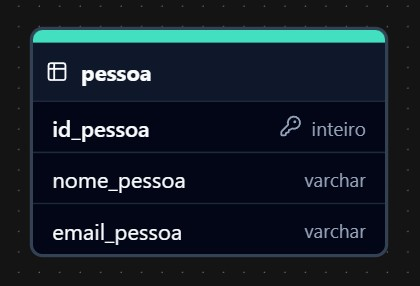

# Curso: Linguagem de Programação em JAVA

### Professor Marcelo

Bem-vindo ao curso de Linguagem de Programação em JAVA! Este curso foi desenvolvido para fornecer uma base sólida na programação Java, abrangendo desde conceitos fundamentais até tópicos avançados. Com as orientações do professor Marcelo, exploraremos as principais ferramentas e conceitos que fazem de Java uma das linguagens mais utilizadas no mundo, focando em resolver problemas, estruturar soluções e criar aplicações robustas e escaláveis. Nosso objetivo é capacitar você a desenvolver aplicações robustas e eficientes, utilizando as melhores práticas da linguagem.

## Índice

- [Aula 01 - Boas Vindas](#aula-01---boas-vindas)
- [Aula 02 - Interfaces](#aula-02---interfaces)
- [Aula 03 - Construtores](#aula-03---construtores)
- [Aula 04 - Enumeradores](#aula-04---enumeradores)
- [Aula 05 - Modificadores de acesso](#aula-05---modificadores-de-acesso)
- [Aula 06 - Matriz](#aula-06---matriz)
- [Aula 07 - Cobranças](#aula-07---cobranças)
- [Aula 08 - Tópicos avançados](#aula-08---tópicos-avançados)
- [Aula 09 - Genéricos](#aula-09---genéricos)
- [Aula 10 - Anotações](#aula-10---anotações)
- [Aula 11 - Fios](#aula-11---fios)
- [Aula 12 - Laços](#aula-12---laços)
- [Aula 13 - Trabalhando com dados](#aula-13---trabalhando-com-dados)
- [Aula 14 - Persistência de dados](#aula-14---persistência-de-dados)
- [Aula 15 - Exceções e controle de erros](#aula-15---exceções-e-controle-de-erros)
- [Aula 16 - Considerações finais](#aula-16---considerações-finais)

## Aula 01 - Boas Vindas

#### Aulas 1.A

**Curso de Java Intermediário:**
  - Objetivo: Capacitar o aluno para desenvolver um projeto Java com atualização em banco de dados.
  - Revisão: Continuação do aprendizado iniciado no curso básico, com foco na orientação a objetos.

**Conceitos Abordados:**
  - **Consultores**, **interfaces** e **numeradores**.
  - Manipulação de **arrays**.
  - Integração de Java com **banco de dados**.

**Projeto Final:**
  - Desenvolvimento de um sistema utilizando uma única tabela.
  - Implementação de métodos para:
    - Acessar banco de dados.
    - **Incluir**, **alterar**, **excluir** e **consultar** elementos específicos.
    - **Consultar todos** os elementos de uma tabela.

**Objetivo Final:** Possibilitar a aplicação prática dos conceitos aprendidos em um sistema funcional com banco de dados.

## Aula 02 - Interfaces

#### Aulas 2.A

**Conceito de Interface:**
  - Uma **interface** é um elemento do Java, criado de forma similar a **classes** e **numeradores**.
  - Permite agrupar classes com características em comum.
  - **Diferencial:** Uma interface pode ser vinculada a várias classes, ao contrário da herança.

**Funcionalidades de uma Interface:**
  - Define métodos comuns para classes relacionadas.
  - Métodos podem incluir ações ou propriedades compartilhadas.

**Características das Interfaces:**
  - Contêm assinaturas de métodos e suas propriedades.
  - Classes vinculadas devem implementar os métodos com a **mesma assinatura**:
    - Mesmo nome.
    - Mesmo retorno.
    - Mesmos parâmetros.
  - Garante **reaproveitamento de código** e melhora a manutenibilidade e legibilidade do programa.

**Assinaturas de Métodos:**
  - Devem ser idênticas entre a interface e as classes que a implementam.
  - Reforçam o princípio de **orientação a objetos** focado no **reaproveitamento de código**.

**Benefícios:**
  - Programas mais **flexíveis** e **manuteníveis**.
  - Melhoria na **legibilidade** do código.

**Próximos Passos:**
  - Demonstração de como criar interfaces e utilizá-las em situações práticas.

#### Aulas 2.B

**O que uma interface deve ter:**
  - Nomeação clara e objetiva.
  - Declaração de métodos com assinaturas específicas, sem implementação.

**Criação de Classes que Implementam a Interface:**
  - Classes utilizam a palavra-chave **implements** para implementar a interface.
  - Implementação obrigatória de todos os métodos declarados na interface.
  - Métodos nas classes devem ter:
    - Mesmo nome.
    - Mesmo tipo de retorno.
    - Mesmos parâmetros.

**Uso de Notações:**
  - O **@Override** é adicionado automaticamente para identificar que o método foi sobrescrito.

**Regras Importantes:**
  - Todos os métodos da interface devem ser implementados nas classes correspondentes.
  - O código gerado automaticamente pode ser ajustado para atender às especificações do projeto.

**Benefícios do Uso de Interfaces:**
  - Promove organização e consistência no código.
  - Facilita a reutilização e a implementação de comportamentos comuns em várias classes.

## Aula 03 - Construtores

#### Aulas 3.A

**O que são Construtores:**
  - São elementos presentes em todas as classes.
  - Toda classe possui pelo menos um **construtor padrão**.
  - Permitem a comunicação entre a parte externa da classe e seus métodos ou atributos.

**Função dos Construtores:**
  - Atuam como um meio de ligação entre a parte externa e interna da classe.
  - Facilitam a inicialização de variáveis e atributos de uma classe.
  - Podem retornar uma, várias ou todas as variáveis de uma classe, conforme necessário.

**Características:**
  - Utilizam a variável **this** para diferenciar valores recebidos e atributos da classe.
  - Reduzem o tráfego de atributos entre diferentes partes do programa.
  - São importantes para o gerenciamento de memória, sendo auxiliados pelo **Garbage Collector** para liberar memória quando não são mais utilizados.

**Regras Importantes:**
  - Construtores são essenciais para a **instanciação** de classes.
  - Ajudam a evitar o uso desnecessário de memória ao limitar a quantidade de atributos trafegados.

**Benefícios:**
  - Facilitam a **organização e encapsulamento** em classes.
  - Contribuem para uma melhor **eficiência no uso da memória**.

#### Aulas 3.B

**Construtores com Sobrecarga:**
  - Permitem receber múltiplos parâmetros ao instanciar uma classe.
  - Podem ser gerados automaticamente utilizando IDEs como Eclipse.
  - Construtores sobrecarregados são úteis para inicializar diversos atributos em uma única chamada.

**Funcionamento:**
  - Atributos são definidos dentro da classe e podem ser inicializados através dos parâmetros do construtor.
  - A variável **this** diferencia os atributos da classe dos valores recebidos pelo construtor.
  - Após a execução, os valores dos parâmetros são atribuídos aos atributos correspondentes.

**Gerenciamento de Memória:**
  - Construtores não utilizados são descartados pelo **Garbage Collector**.
  - Variáveis são carregadas na memória apenas quando criadas.

**Cálculo de Valores:**
  - Métodos dentro da classe podem ser chamados após a inicialização dos atributos para realizar cálculos.
  - Os métodos utilizam os valores armazenados nos atributos da classe.

**Uso de Enumeradores:**
  - Enumeradores podem ser utilizados para definir valores específicos associados a atributos.
  - Ajudam a representar estados ou categorias, como "aprovado" ou "reprovado".

**Regras Importantes:**
  - Todos os parâmetros definidos no construtor devem ser devidamente atribuídos aos atributos da classe.
  - Construtores são flexíveis e podem ser adaptados conforme a necessidade do programa.

**Benefícios dos Construtores:**
  - Facilitam a troca de informações entre o método principal e as classes.
  - Melhoram a organização e a inicialização de variáveis dentro das classes.
  - São cruciais para garantir consistência e eficiência na manipulação de dados.

## Aula 04 - Enumeradores

#### Aulas 4.A

**Enumeradores:**
  - Enumeradores são estruturas que permitem definir valores fixos associados a um atributo.
  - Ajudam a representar estados ou categorias com valores limitados e bem definidos.
  - Substituem tabelas de banco de dados para armazenar valores simples e repetitivos.

**Criação de Enumeradores:**
  - Podem ser definidos dentro ou fora de uma classe.
  - Cada valor do enumerador é tratado como uma constante.
  - Exemplo de uso: `matriculado`, `pendente`, `reprovado`.

**Funcionamento:**
  - Atributos da classe utilizam o enumerador como tipo de dado.
  - Ao atribuir valores, o enumerador fornece opções pré-definidas, facilitando o controle e a validação.

**Benefícios dos Enumeradores:**
  - Melhoram a legibilidade do código ao substituir valores arbitrários por constantes nomeadas.
  - Facilitam a manutenção e evitam erros ao limitar as opções possíveis.
  - São amplamente utilizados para representar status ou condições específicas.

**Regras Importantes:**
  - Enumeradores são imutáveis, ou seja, seus valores não podem ser alterados em tempo de execução.
  - Devem ser usados para categorias com um número fixo de opções.

**Uso Prático:**
  - Permitem verificar e alterar o estado de atributos com base em condições do programa.
  - Podem ser exibidos ou manipulados diretamente no código com boa integração em IDEs.
  - Garantem que o programa seja mais eficiente e consistente.

**Legibilidade e Flexibilidade:**
  - Enumeradores tornam o código mais claro e compreensível.
  - São úteis para estruturar programas com requisitos fixos e categorias predefinidas.

## Aula 05 - Modificadores de acesso

#### Aulas 5.A
**Modificadores de Acesso:**
  - Definem o nível de acesso a classes, atributos e métodos em um programa Java.
  - São fundamentais para implementar **encapsulamento** e controlar a visibilidade de elementos.

**Funções Principais:**
  - Garantir **segurança** e **controle** ao proteger informações sensíveis.
  - Melhorar a **organização** e a **manutenibilidade** do código.
  - Restringir ou permitir o uso de elementos conforme necessário.

**Benefícios:**
  - Promovem **segurança** no acesso aos dados.
  - Facilitam o **encapsulamento** e a modularização do código.
  - Garantem que apenas partes relevantes do código sejam expostas.

**Boas Práticas:**
  - Evitar uso desnecessário de **public** em atributos e métodos.
  - Manter consistência na aplicação dos modificadores para melhorar a clareza do código.

#### Aulas 5.B

**Tipos de Modificadores de Acesso:**
  - **Private:** Maior nível de restrição, acesso permitido apenas dentro da própria classe.
  - **Default:** Acesso restrito ao mesmo pacote, aplicado automaticamente quando nenhum modificador é explicitado.
  - **Protected:** Permite acesso dentro do mesmo pacote e por subclasses, mesmo em pacotes diferentes.
  - **Public:** Menor nível de restrição, permite acesso de qualquer classe.

**Níveis de Modificadores:**
  - **Nível Superior:**
    - Aplicável a **classes**.
    - Modificadores possíveis: **Public** e **Default**.
    - O **Default** é assumido quando nenhum modificador é definido explicitamente.
  - **Nível de Membro:**
    - Aplicável a **atributos** e **métodos**.
    - Modificadores possíveis: **Private**, **Default**, **Protected** e **Public**.
    - O **Default** é assumido automaticamente caso nenhum modificador seja declarado.

**Ordem de Restrição:**
  - **Private** → **Default** → **Protected** → **Public**.
  - A visibilidade aumenta conforme o nível de acesso se torna menos restritivo.

**Função dos Modificadores:**
  - Controlar a visibilidade e acessibilidade de elementos entre classes e pacotes.
  - Garantir **segurança** e **encapsulamento**, restringindo o uso indevido de atributos e métodos.

**Regras Importantes:**
  - Sempre definir modificadores de acesso para evitar ambiguidade no código.
  - Utilizar **private** para dados sensíveis e expor apenas o necessário usando **getters** e **setters**.

#### Aulas 5.C

**Modificador de Acesso Público (Public):**
  - Permite acesso irrestrito a atributos e métodos de uma classe.
  - Pode ser acessado de qualquer classe, independentemente do pacote.

**Características:**
  - Compartilha informações entre classes relacionadas ou não.
  - Não há limitações de visibilidade em pacotes diferentes ou no mesmo pacote.
  - Permite instanciar e acessar atributos ou métodos de qualquer lugar.

**Casos de Uso:**
  - Em uma classe, atributos ou métodos marcados como **public** podem ser acessados por outras classes sem restrição.
  - Exemplos comuns incluem métodos utilitários e atributos que precisam ser amplamente disponíveis.

**Visibilidade do Modificador Public:**

| **Contexto**                              | **Visibilidade do Modificador Public** |
|-------------------------------------------|----------------------------------------|
| Classes derivadas no mesmo pacote         | Acessível                              |
| Classes derivadas em pacotes diferentes   | Acessível                              |
| Classes não relacionadas no mesmo pacote  | Acessível                              |
| Classes não relacionadas em pacotes diferentes | Acessível                          |

**Regras Importantes:**
  - Usar com cautela, pois **public** expõe todos os detalhes sem restrições.
  - Deve ser aplicado apenas a elementos que precisam ser amplamente acessíveis.

**Riscos:**
  - Reduz o encapsulamento e pode comprometer a segurança do programa.
  - Requer planejamento cuidadoso para evitar uso inadequado ou excessivo.

**Benefícios:**
  - Simplifica o compartilhamento de funcionalidades entre diferentes partes do programa.
  - Facilita a reutilização de código em múltiplos contextos.

#### Aulas 5.D

**Modificador de Acesso Protected:**
  - Define que atributos e métodos marcados como **protected** são acessíveis:
    - Dentro da mesma classe.
    - Por classes derivadas, mesmo que estejam em pacotes diferentes.
    - Por classes no mesmo pacote.

**Características:**
  - Funciona como uma combinação entre os níveis **default** e **public**.
  - Permite visibilidade limitada para manter o encapsulamento em pacotes diferentes.
  - Classes não relacionadas, em pacotes diferentes, não têm acesso.

**Casos de Uso:**
  - Utilizado para proteger atributos e métodos que devem ser acessíveis apenas por classes diretamente relacionadas.
  - Ideal para herança, permitindo que subclasses acessem elementos protegidos.

**Visibilidade do Modificador Protected:**

| **Contexto**                              | **Visibilidade do Modificador Protected** |
|-------------------------------------------|-------------------------------------------|
| Classes derivadas no mesmo pacote         | Acessível                                 |
| Classes derivadas em pacotes diferentes   | Acessível                                 |
| Classes não relacionadas no mesmo pacote  | Acessível                                 |
| Classes não relacionadas em pacotes diferentes | Não acessível                         |

**Regras Importantes:**
  - Classes no mesmo pacote têm acesso aos elementos **protected**.
  - Subclasses podem acessar elementos **protected** mesmo fora do pacote original.
  - Classes não relacionadas, em pacotes diferentes, não conseguem acessar.

**Benefícios:**
  - Garante encapsulamento parcial, permitindo acesso controlado para herança.
  - Promove organização ao limitar acessos desnecessários em pacotes diferentes.

#### Aulas 5.E

**Modificador de Acesso Private:**
  - É o modificador mais restritivo.
  - Permite acesso somente dentro da própria classe.
  - Nenhuma classe externa, mesmo no mesmo pacote, pode acessar diretamente atributos ou métodos privados.

- **Características:**
  - Garante total encapsulamento de atributos e métodos.
  - Torna obrigatória a instanciação da classe para acesso indireto aos seus elementos.
  - Atributos e métodos **private** podem ser expostos externamente apenas por meio de **getters**, **setters** ou construtores.

**Funcionamento:**
  - Mesmo ao importar uma classe de outro pacote, atributos e métodos privados não são acessíveis.
  - Apenas elementos **public** ou com visibilidade compatível (como **protected**) podem ser acessados por classes relacionadas.

**Casos de Uso:**
  - Para proteger informações sensíveis ou evitar manipulação direta de dados internos.
  - Permite maior controle sobre como os dados são manipulados.

**Regras Importantes:**
  - Atributos ou métodos marcados como **private** só podem ser acessados pela própria classe.
  - Construtores, **getters** e **setters** são meios para expor dados de forma controlada.

**Comparativo de Visibilidade:**
  | **Modificador** | **Mesma Classe** | **Mesmo Pacote** | **Subclasses (Pacotes Diferentes)** | **Classes Não Relacionadas** |
  |------------------|------------------|------------------|-------------------------------------|------------------------------|
  | Public           | Sim              | Sim              | Sim                                 | Sim                          |
  | Protected        | Sim              | Sim              | Sim                                 | Não                          |
  | Default          | Sim              | Sim              | Não                                 | Não                          |
  | Private          | Sim              | Não              | Não                                 | Não                          |

**Benefícios:**
  - Garante o controle total sobre os dados internos da classe.
  - Melhora a segurança e a integridade do programa.
  - Promove boas práticas de encapsulamento, incentivando o uso de métodos controladores como **getters** e **setters**.

#### Aulas 5.F

**Modificador de Acesso Default:**
  - Aplicado automaticamente quando nenhum modificador é explicitado.
  - Restringe o acesso aos elementos apenas dentro do mesmo pacote.

**Características:**
  - Permite acesso entre classes e métodos que compartilham o mesmo pacote.
  - Não permite acesso por classes de pacotes diferentes, mesmo se forem relacionadas.
  - É mais restritivo que o **public**, mas menos que o **protected** e **private**.

**Funcionamento:**
  - Atributos ou métodos sem um modificador declarado explicitamente assumem o **default**.
  - Classes dentro do mesmo pacote podem acessar atributos e métodos **default** sem restrições.
  - Classes fora do pacote original não têm acesso, mesmo que sejam subclasses.

**Casos de Uso:**
  - Utilizado para organizar o acesso de elementos que devem ser visíveis apenas dentro de um contexto restrito (pacote).
  - Útil para programas que possuem pacotes claramente segmentados por funcionalidades.

**Regras Importantes:**
  - O modificador **default** é o padrão quando não se especifica **public**, **protected** ou **private**.
  - É restritivo a classes do mesmo pacote e não é recomendado para elementos que precisam ser amplamente acessíveis.

**Comparação com Outros Modificadores:**
  - O **default** é mais restritivo que o **public** e o **protected**, mas menos que o **private**.
  - A diferença é perceptível ao tentar acessar atributos ou métodos a partir de pacotes diferentes.

**Benefícios:**
  - Mantém o encapsulamento parcial ao limitar o acesso ao escopo do pacote.
  - Facilita a organização e segurança em sistemas com múltiplos pacotes.

## Aula 06 - Matriz

#### Aulas 6.A

**Arrays em Java:**
  - Estruturas fundamentais para armazenar e organizar dados.
  - Semelhantes a conceitos de listas e matrizes.

**Objetivo:**
  - Facilitar o armazenamento e manipulação de múltiplos valores relacionados em uma única estrutura.

**Características:**
  - Os arrays são sequências ordenadas.
  - Cada elemento do array pode ser acessado por sua posição, chamada de índice.

**Importância:**
  - Proporcionam uma maneira eficiente de trabalhar com grandes volumes de dados.
  - Fundamentais para a lógica de programação e organização de dados em Java.

#### Aulas 6.B

**Arrays em Java:**
  - Estruturas de dados utilizadas para armazenar múltiplos valores do mesmo tipo.
  - Divididos em **unidimensionais** (vetores) e **multidimensionais** (matrizes).

**Criação de Arrays:**
  - Requer a definição do tipo de dado, nome do array e alocação de memória usando `new`.
  - O tamanho do array é fixo e definido no momento de sua criação.
  - Exemplo básico:
    - `int[] numeros = new int[4];` (array com quatro posições).

**Atributos e Funcionamento:**
  - Os índices começam em **0** e vão até o tamanho do array menos um.
  - Cada posição do array armazena um valor específico do tipo declarado.
  - Acessar índices fora do limite resulta em um erro (**ArrayIndexOutOfBoundsException**).

**Inicialização de Arrays:**
  - **Imediata:** Valores são definidos no momento da declaração.
    - Exemplo: `int[] valores = {12, 32, 64, 6, 8};`.
  - **Posterior:** A memória é alocada e os valores atribuídos posteriormente.
    - Exemplo:
      - `int[] meuArray;`
      - `meuArray = new int[10];`.

**Utilização:**
  - Ideal para armazenar dados sequenciais ou estruturados de maneira eficiente.
  - Pode ser usado em combinação com laços como **for** para iterar sobre seus elementos.

**Erros Comuns:**
  - Acessar posições que não existem no array.
  - Não inicializar o array antes de utilizá-lo.

**Vantagens:**
  - Permite organizar e acessar dados de forma sequencial.
  - Estrutura simples e eficiente para trabalhar com volumes fixos de dados.

#### Aulas 6.C

**Inicialização Padrão de Arrays:**
  - Elementos de arrays recebem valores padrão se não forem inicializados explicitamente:
    - **Numéricos:** Inicializados com `0`.
    - **Booleanos:** Inicializados com `false`.
    - **Referências:** Inicializadas com `null`.

**Inicialização Personalizada:**
  - Arrays podem ser inicializados com valores específicos no momento da criação.
  - Exemplo: `String[] paises = {"Brasil", "Alemanha", "Itália", "Polônia"};`.

**Iteração sobre Arrays:**
  - O loop **for-each** é uma forma eficiente de iterar sobre os elementos de um array.
    - Exemplo básico:
      ```java
      for (String pais : paises) {
          System.out.println(pais);
      }
      ```
  - O laço percorre os elementos do array automaticamente, parando quando todos os itens são acessados.

- **Indexação em Arrays:**
  - Outra forma de iterar é utilizando um índice para acessar posições específicas do array.
  - Essa abordagem permite modificar elementos diretamente no array.

**Práticas com Arrays:**
  - Inicializar arrays interativamente (como entrada do usuário).
  - Alterar valores armazenados em posições específicas.
  - Explorar diferentes abordagens para manipular e listar elementos.

**Vantagens de Iteração com Arrays:**
  - **For-each:** Simplicidade e legibilidade.
  - **Indexador:** Maior controle sobre índices e valores individuais.

#### Aulas 6.D

**Manipulação de Arrays em Java:**
  - Arrays são estruturas de dados que armazenam múltiplos valores do mesmo tipo.
  - Permitem tanto inicialização direta quanto inserção de dados de forma iterativa.

**Declaração e Inicialização de Arrays:**
  - Podem ser declarados com tamanho fixo e valores iniciais:
    - Exemplo: `String[] paises = new String[4];`.
  - Valores podem ser atribuídos diretamente ou por meio de interação com o usuário.

**Iteração sobre Arrays:**
  - Utiliza-se laços como **for** para preencher ou listar os valores.
  - O índice começa em **0** e vai até o tamanho do array menos um.
  - O laço **for** facilita a navegação e manipulação dos elementos.

**Alteração de Valores em Arrays:**
  - É possível modificar valores específicos indicando a posição desejada.
  - Exemplo: `array[2] = novoValor;`.

**Erros Comuns e Prevenção:**
  - Tentar acessar posições inexistentes gera uma exceção (**ArrayIndexOutOfBoundsException**).
  - Garantir que o índice utilizado esteja dentro do limite definido.

**Boas Práticas:**
  - Utilizar comentários para descrever a funcionalidade de partes importantes do código.
  - Evitar a duplicação de lógica e manter a legibilidade do código.

**Benefícios:**
  - Permitem organização de dados de maneira sequencial e eficiente.
  - Suportam cálculos e manipulações diretas em valores armazenados.
  - Oferecem flexibilidade para inicialização e alteração conforme necessidade.

#### Aulas 6.E

**Matrizes (Arrays Bidimensionais) em Java:**
  - Representam **vetores de vetores**, ou seja, arrays contendo outros arrays.
  - Utilizadas para organizar dados em linhas e colunas, como tabelas ou planilhas.

**Criação de Matrizes:**
  - Declaradas com dois conjuntos de colchetes.
    - Exemplo: `float[][] notas = new float[3][4];`.
    - **3 linhas** e **4 colunas** no exemplo acima.
  - Cada posição é acessada por dois índices: `[linha][coluna]`.

**Funcionamento:**
  - Permite armazenar dados como em um boletim:
    - Cada linha representa um aluno.
    - Cada coluna representa uma nota.
  - Exemplo:
    - `notas[0][0]`: Primeira nota do primeiro aluno.
    - `notas[1][2]`: Terceira nota do segundo aluno.

**Iteração com Matrizes:**
  - Utiliza dois laços **for** aninhados:
    - O **for externo** itera sobre as linhas.
    - O **for interno** itera sobre as colunas.
  - Exemplo:
    ```java
    for (int i = 0; i < alunos.length; i++) {
        for (int j = 0; j < notas[i].length; j++) {
            // Processar cada nota
        }
    }
    ```

**Cálculo e Condições:**
  - Calcular a média de cada aluno somando as notas e dividindo pelo número de colunas.
  - Regras para definir o status do aluno:
    - Média maior ou igual a 7.5: **Aprovado**.
    - Média entre 5.5 e 7.5: **Recuperação**.
    - Média menor que 5.5: **Reprovado**.

**Boletins e Resultados:**
  - Para cada aluno:
    - Imprimir o nome, notas, média e status (Aprovado, Recuperação ou Reprovado).
  - Exemplo de saída:
    ```
    Aluno: João
    Nota 1: 8
    Nota 2: 8
    Nota 3: 8
    Nota 4: 8
    Média: 8
    Status: Aprovado
    ```

**Boas Práticas:**
  - Inicializar variáveis como somatórios dentro do laço externo para evitar contaminação entre alunos.
  - Usar comentários para descrever a lógica de cálculo e iteração.

**Benefícios de Matrizes:**
  - Organizam dados de forma estruturada e eficiente.
  - Facilmente iteráveis com laços aninhados.
  - Permitem a representação de relacionamentos entre conjuntos de dados.


## Aula 07 - Cobranças

#### Aulas 7.A

**Collections em Java:**
  - **Introdução ao Tema:**
    - As **Collections** são interfaces que fornecem estruturas de dados dinâmicas e flexíveis.
    - Permitem manipular listas, mapas e conjuntos de forma eficiente.
    - São amplamente utilizadas para substituir arrays fixos e oferecem métodos prontos para manipulação.

**O que será abordado:**
  - **Listas (List):**
    - Estruturas que armazenam elementos ordenados e permitem duplicatas.
  - **Mapas (Map):**
    - Associam chaves únicas a valores, facilitando buscas.
  - **ArrayList:**
    - Lista dinâmica baseada em arrays.
    - Oferece funcionalidades como adição, remoção, alteração e busca de elementos.
    - Integra métodos úteis para manipulação de dados e controle de posições.

**Objetivo do Estudo:**
  - Explorar a flexibilidade e as funcionalidades do **ArrayList**.
  - Demonstrar como localizar, modificar e substituir elementos em um **ArrayList**.
  - Mostrar como as **Collections** tornam a manipulação de dados mais prática e eficiente.

#### Aulas 7.B

**Collections no Java:**
  - As Collections são estruturas de dados dinâmicas que permitem manipular e organizar objetos de maneira eficiente.
  - A interface **Collection** fornece métodos gerais para operações como adição, remoção, busca e iteração de elementos.

**Diferentes Implementações de Lists:**
  - **ArrayList:**
    - Otimizado para acesso e manipulação no meio da lista.
    - Similar a arrays, mas com tamanho ajustável dinamicamente.
  - **LinkedList:**
    - Ideal para operações nas extremidades (início e fim da lista).
    - Baseada em nós ligados, o que facilita inserções e remoções.

**Características de ArrayList:**
  - Permite adicionar elementos sem um tamanho pré-definido.
  - Oferece métodos como `add()`, `remove()`, `get()`, e `set()`.
  - Dinamicamente ajustável:
    - Exemplo: O tamanho inicial pode ser 10, mas cresce conforme elementos são adicionados.
  - Integra-se bem com laços como **for**, utilizando métodos como `size()` para determinar o tamanho atual.

**Diferença entre Arrays e ArrayList:**
  - **Arrays:**
    - Tamanho fixo, definido no momento da criação.
    - Menor flexibilidade para adicionar ou remover elementos.
  - **ArrayList:**
    - Tamanho ajustável dinamicamente.
    - Oferece maior flexibilidade e métodos para manipulação.

**Vantagens das Lists em Collections:**
  - Evitam a necessidade de definir tamanhos fixos.
  - Permitem localizar e modificar elementos facilmente.
  - Suportam operações dinâmicas como adição e remoção em qualquer posição.

**Próximos Passos:**
  - Praticar o uso de **ArrayList** com métodos dinâmicos.
  - Explorar a utilização de **LinkedList** e compreender suas diferenças.

#### Aulas 7.C

**Uso Prático do ArrayList:**
  - Estrutura dinâmica que substitui arrays tradicionais com maior flexibilidade.
  - Permite operações como adição, remoção, modificação e busca de elementos.

**Criação e Configuração:**
  - Declarado utilizando a **estrutura de diamante** para especificar o tipo:
    - Exemplo: `ArrayList<String> carros = new ArrayList<>();`.
  - Requer importação da classe `java.util.ArrayList`.

**Principais Métodos do ArrayList:**
  - **add(element):** Adiciona um elemento ao final da lista.
  - **add(index, element):** Insere um elemento em uma posição específica.
  - **get(index):** Retorna o elemento na posição especificada.
  - **set(index, element):** Substitui o elemento em uma posição específica.
  - **remove(element):** Remove o primeiro elemento encontrado que corresponda ao valor.
  - **size():** Retorna o tamanho atual da lista.
  - **clear():** Remove todos os elementos da lista.
  - **contains(element):** Verifica se um elemento existe na lista.
  - **indexOf(element):** Retorna a posição do elemento especificado.

**Características:**
  - Elementos são armazenados na ordem de inserção.
  - O tamanho da lista é ajustado automaticamente conforme elementos são adicionados ou removidos.

**Exemplo de Operações:**
  - **Adicionar elementos:**
    ```java
    carros.add("Fusca");
    carros.add("Sandero");
    ```
  - **Substituir elementos:**
    ```java
    carros.set(1, "BMW");
    ```
  - **Remover elementos por valor:**
    ```java
    carros.remove("Fusca");
    ```
  - **Buscar elementos e modificar dinamicamente:**
    - Utilizando um laço `for` para localizar e alterar elementos.

**Iteração e Verificação:**
  - O método `for` é utilizado para percorrer os elementos com base no tamanho da lista (`size()`).
  - Permite buscas e alterações dinâmicas baseadas no conteúdo ou posição dos elementos.

**Tratamento de Casos Específicos:**
  - Implementação de lógica condicional para situações em que elementos não sejam encontrados.
  - Uso de métodos como `contains()` para evitar operações em elementos inexistentes.

**Benefícios do ArrayList:**
  - Evita a necessidade de pré-definir tamanhos como em arrays.
  - Oferece maior flexibilidade com métodos integrados para manipulação eficiente.
  - Simples de integrar com interfaces gráficas ou métodos que interajam com o usuário.

#### Aulas 7.D

**LinkedList em Java:**
  - Estrutura de dados dinâmica similar ao **ArrayList**.
  - Especializada para operações nas extremidades (início e fim da lista).

**Diferenciais do LinkedList:**
  - Otimizado para inserções e remoções nas pontas.
  - Oferece métodos específicos como `addFirst()`, `addLast()`, `removeFirst()`, e `removeLast()`.

**Comparação com ArrayList:**
  - **LinkedList:** Melhor performance em operações nas extremidades.
  - **ArrayList:** Melhor performance em acessos e manipulações na parte central da lista.

#### Aulas 7.E

**LinkedList em Java:**
  - Estrutura de dados dinâmica especializada em manipulação de elementos nas extremidades.
  - Compartilha características com o **ArrayList**, mas com foco em operações no início e fim da lista.

**Criação do LinkedList:**
  - Declaração semelhante ao **ArrayList**, utilizando a estrutura de diamante:
    ```java
    LinkedList<String> carros = new LinkedList<>();
    ```
  - Requer importação da classe `java.util.LinkedList`.

**Principais Métodos do LinkedList:**
  - **Inserções:**
    - `addFirst(element)`: Adiciona um elemento no início.
    - `addLast(element)`: Adiciona um elemento no fim.
    - `add(index, element)`: Insere em uma posição específica.
  - **Remoções:**
    - `removeFirst()`: Remove o primeiro elemento.
    - `removeLast()`: Remove o último elemento.
  - **Acessos:**
    - `getFirst()`: Retorna o primeiro elemento.
    - `getLast()`: Retorna o último elemento.
    - `get(index)`: Retorna o elemento em uma posição específica.
  - **Outros Métodos:**
    - `clear()`: Remove todos os elementos da lista.
    - `isEmpty()`: Verifica se a lista está vazia.

**Exemplo de Operações:**
  - Inserção de elementos:
    ```java
    carros.addFirst("Mazda");
    carros.addLast("Bugatti");
    ```
  - Remoção de elementos:
    ```java
    carros.removeFirst();
    carros.removeLast();
    ```
  - Acessar elementos:
    ```java
    String primeiroCarro = carros.getFirst();
    String ultimoCarro = carros.getLast();
    ```

**Comparação com ArrayList:**
  - **LinkedList:**
    - Melhor para operações frequentes de inserção e remoção nas extremidades.
  - **ArrayList:**
    - Mais eficiente para acesso e manipulação de elementos no meio da lista.

**Finalização:**
  - Os métodos de `LinkedList` permitem flexibilidade em diferentes contextos, mesmo compartilhando funções comuns com o **ArrayList**, como `clear()` e `isEmpty()`.

## Aula 08 - Tópicos avançados

#### Aulas 8.A

**Próximos Tópicos em Java:**
  - **Genéricos (Generics):**
    - Ferramentas que permitem criar classes, interfaces e métodos que trabalham com tipos parametrizados.
    - Garantem maior segurança e flexibilidade ao lidar com diferentes tipos de dados.

  - **Anotações (Annotations):**
    - Metadados que fornecem informações ao compilador ou ao tempo de execução.
    - Amplamente utilizados em frameworks e bibliotecas Java.

  - **Threads (Multithreading):**
    - Técnicas para executar várias tarefas simultaneamente dentro de um programa.
    - Cruciais para aplicações que requerem desempenho e paralelismo.

**Objetivo do Estudo:**
  - Explorar conceitos avançados para melhorar a escrita, organização e execução de programas Java.
  - Demonstrar como Genéricos, Anotações e Threads tornam o código mais robusto e eficiente.

#### Aulas 8.B

**Classes Wrapper em Java:**
  - São classes disponíveis no pacote **java.lang**, que encapsulam tipos primitivos em objetos.
  - Permitem conversões e operações avançadas com tipos primitivos.

**Tipos e Correspondências:**
  - **Lógicos:** `boolean` → `Boolean`.
  - **Caractere:** `char` → `Character`.
  - **Numéricos Integrais:**
    - `byte` → `Byte`.
    - `short` → `Short`.
    - `int` → `Integer`.
    - `long` → `Long`.
  - **Numéricos Flutuantes:**
    - `float` → `Float`.
    - `double` → `Double`.

**Vantagens das Classes Wrapper:**
  - Realizam conversões entre tipos primitivos e objetos de forma eficiente.
  - Facilitam operações complexas como cálculos, formatações e comparações.
  - Permitem o uso de métodos utilitários, como `parse` e `toString`.

**Boxing e Unboxing:**
  - **Boxing:** Converte um tipo primitivo em um objeto Wrapper.
    - Exemplo: `Integer numero = Integer.valueOf(5);`.
  - **Unboxing:** Converte um objeto Wrapper de volta para o tipo primitivo.
    - Exemplo: `int numero = Integer.parseInt("5");`.

**Automação de Boxing e Unboxing:**
  - O compilador realiza essas conversões automaticamente quando necessário:
    - **Auto-boxing:** De primitivo para Wrapper.
    - **Auto-unboxing:** De Wrapper para primitivo.

**Aplicação Prática:**
  - Uso comum em coleções e métodos que exigem objetos, como listas (`ArrayList`).
  - Permitem manipular tipos primitivos como objetos, adicionando flexibilidade ao código.

**Exemplo de Conversão com Classes Wrapper:**
  ```java
  int numero = 10;
  Integer wrapperNumero = numero; // Auto-boxing
  int primitivoNumero = wrapperNumero; // Auto-unboxing
  ```

**Importância:**
  - Facilita a manipulação de dados em estruturas complexas e métodos avançados.
  - Oferece eficiência e conveniência, especialmente em laços e expressões complexas.

#### Aulas 8.C

**Implementação de Classes Wrapper:**
  - As **classes wrapper** encapsulam tipos primitivos, permitindo utilizá-los como objetos.
  - São amplamente utilizadas para conversões de tipos primitivos para objetos e vice-versa.

**Uso de Classes Wrapper:**
  - **Boolean, Character, Integer, Float, Double, etc.**
    - Representam os tipos primitivos correspondentes como objetos.
    - Possuem métodos utilitários como `parse` e `valueOf` para conversões e manipulações.

**Exemplo Prático:**
  - Conversão de uma **String** para um tipo primitivo utilizando **Integer.parseInt**:
    ```java
    String numeroTexto = "1";
    int numero = Integer.parseInt(numeroTexto); // Conversão para int
    numero = numero + 1; // Operação com o valor convertido
    System.out.println(numero); // Saída: 2
    ```

**Boxing e Unboxing na Implementação:**
  - **Boxing:** O valor primitivo é encapsulado em um objeto wrapper.
  - **Unboxing:** O objeto wrapper é convertido de volta para um tipo primitivo.
    - Exemplo:
      ```java
      Integer numeroWrapper = Integer.valueOf(10); // Boxing
      int numeroPrimitivo = numeroWrapper; // Unboxing
      ```

**Vantagens:**
  - Permitem manipular tipos primitivos em estruturas de dados que exigem objetos, como **ArrayList**.
  - Facilitam operações complexas, como conversões e manipulação em coleções.
  - Integram métodos utilitários para facilitar cálculos e transformações.

**Considerações:**
  - As classes wrapper são essenciais para trabalhar com dados em Java modernos.
  - Serão frequentemente usadas em operações com coleções e manipulação de dados no decorrer do curso.

## Aula 09 - Genéricos

#### Aulas 9.A

**Generics em Java:**
  - Permitem criar classes, interfaces e métodos que trabalham com tipos parametrizados.
  - Aumentam a **reutilização de código** e reduzem a necessidade de conversões explícitas de tipos.

**Características dos Generics:**
  - Tipagem dinâmica definida no momento da criação do objeto ou uso da classe.
  - Elimina a necessidade de **cast** (conversão de tipos) ao manipular dados.
  - Garante maior segurança ao detectar erros de tipo em tempo de compilação.

**Exemplo Básico de Uso:**
  - Utilização em listas:
    ```java
    List<String> lista = new ArrayList<>();
    lista.add("Exemplo");
    String elemento = lista.get(0); // Sem necessidade de cast
    ```

**Benefícios:**
  - **Reutilização:** Evita a reescrita de código ao trabalhar com diferentes tipos.
  - **Segurança:** Reduz o risco de erros de tipo em tempo de execução.
  - **Legibilidade:** Simplifica o código ao eliminar conversões manuais repetitivas.

#### Aulas 9.B

**Uso Prático de Generics em Java:**
  - **Generics** permitem criar classes e métodos que trabalham com tipos parametrizados, aumentando a flexibilidade e a reutilização de código.

**Exemplo com Generics:**
  - Cenário: Gerenciar voos em um pátio de aeroporto (ordem de chegada e decolagem).
  - Implementação sem Generics:
    - Definir a classe e métodos diretamente tipados, como `Integer` para os números dos voos.
    - Cada vez que o tipo muda, é necessário alterar todos os métodos e declarações associadas.
  - Implementação com Generics:
    - Utilizar um tipo genérico `<T>` na definição da classe e métodos.
    - O tipo é definido no momento da instânciação da classe.
    - Exemplo:
      ```java
      public class Aeronaves<T> {
          private List<T> voos = new ArrayList<>();
          public void adicionarVoo(T voo) {
              voos.add(voo);
          }
          public T primeiroVoo() {
              return voos.get(0);
          }
      }
      ```

**Flexibilidade dos Generics:**
  - Alterar o tipo ao instanciar sem modificar a classe ou métodos.
    ```java
    Aeronaves<Integer> aeronavesInteiros = new Aeronaves<>();
    Aeronaves<String> aeronavesStrings = new Aeronaves<>();
    ```
  - Os métodos funcionam independentemente do tipo utilizado.

**Benefícios Práticos:**
  - **Reutilização de Código:** Não é necessário criar versões diferentes da mesma classe ou método para tipos diferentes.
  - **Segurança de Tipos:** O compilador garante que apenas os tipos corretos sejam utilizados, reduzindo erros de tempo de execução.
  - **Redução de Conversões:** Elimina a necessidade de casts para manipular objetos.

**Aplicação no Exemplo:**
  - Com Generics, é possível alternar entre números de voos (`Integer`) e identificadores textuais (`String`) sem modificar a lógica da classe.
  - O tipo genérico `<T>` se adapta ao tipo definido no momento da instânciação.

**Conclusão:**
  - Generics tornam o código mais flexível, reutilizável e seguro.
  - São essenciais em cenários onde o tipo de dados pode variar, mas a lógica permanece a mesma.

## Aula 10 - Anotações

#### Aulas 10.A

**Anotações (Annotations) em Java:**
  - São metadados utilizados para fornecer informações adicionais ao código.
  - Podem ser aplicadas em tempo de compilação, execução ou construção do projeto.

**Exemplos de Anotações Comuns:**
  - **@Override:** Indica que um método está sobrescrevendo um método da superclasse.
  - **@Deprecated:** Marca um elemento como obsoleto, indicando que não deve ser mais utilizado.
  - **@SuppressWarnings:** Suprime avisos específicos do compilador.
  - **@Test:** Utilizada em frameworks de teste, como o JUnit, para indicar métodos de teste.

**Tipos de Uso:**
  - **Documentação:** Ferramentas como JavaDoc utilizam anotações para gerar documentação do código.
  - **Compilação:** Informações fornecidas pelas anotações ajudam o compilador a validar o código.
  - **Execução:** Frameworks como Spring e ferramentas de serialização (ex.: XML, JSON) usam anotações para configurar e gerenciar objetos dinamicamente.

**Benefícios das Anotações:**
  - Facilitam a integração com frameworks e ferramentas.
  - Tornam o código mais legível e organizado.
  - Simplificam processos como testes automatizados, validação e serialização.

**Aplicações Práticas:**
  - **Ferramentas de Teste:** Identificação de métodos de teste com **@Test**.
  - **Frameworks Web:** Configuração de rotas e dependências com anotações como **@Controller** e **@Autowired** no Spring.
  - **Serialização:** Especificação de mapeamentos com anotações para XML ou JSON.

**Importância:**
  - As anotações são amplamente utilizadas em projetos modernos para melhorar a organização e eficiência do código.
  - São fundamentais para o desenvolvimento baseado em frameworks e programação orientada a aspectos.

#### Aulas 10.B

**Uso Prático de Anotações (Annotations):**
  - Demonstram como as anotações são aplicadas em métodos para fornecer informações adicionais e facilitar o gerenciamento do código.

**Exemplo Prático:**
  - Criado um projeto para testar anotações em Java.
  - Utilização da anotação **@Deprecated** para marcar um método como obsoleto.
    ```java
    @Deprecated
    public void exibido() {
        System.out.println("Este método está obsoleto.");
    }
    ```

**Comportamento ao Usar @Deprecated:**
  - Quando um método marcado com **@Deprecated** é chamado:
    - O compilador exibe um aviso de que o método está obsoleto.
    - Indica que o uso é possível, mas desaconselhado.
    - A execução do método ocorre normalmente, com o aviso sendo exibido durante a compilação.

**Vantagens de @Deprecated:**
  - Ajuda a identificar partes do código que não devem mais ser usadas.
  - Fornece tempo para os desenvolvedores migrarem para métodos ou funcionalidades atualizadas.
  - Melhora a manutenção ao destacar trechos do código que precisam ser revisados.

**Outras Aplicações de Anotações:**
  - **Documentação:** Utilizadas por ferramentas como JavaDoc para gerar documentação de métodos e classes.
  - **Testes:** Frameworks como JUnit utilizam anotações para indicar métodos de teste (ex.: **@Test**).
  - **Controle de Código:** Anotações como **@SuppressWarnings** ajudam a suprimir avisos do compilador.

**Considerações:**
  - Anotações como **@Deprecated** são usadas em tempo de compilação e ajudam a alertar desenvolvedores sobre práticas desaconselhadas.
  - Apesar dos avisos, o método ainda pode ser executado, mas seu uso deve ser evitado.

## Aula 11 - Fios

#### Aulas 11.A

**Introdução a Threads em Java:**
  - Threads são conjuntos de instruções que podem ser executados simultaneamente dentro de um processo.
  - Permitem que diferentes tarefas sejam realizadas em paralelo, melhorando a eficiência de execução.

**Funcionamento:**
  - Um processo pode conter várias threads, cada uma com sua sequência de instruções.
  - A execução das threads é controlada pelo escalonador do sistema operacional.
  - A ordem de execução das threads pode variar dependendo:
    - Da estratégia do escalonador.
    - Da performance do hardware e da máquina.

**Características:**
  - A execução de threads não é determinística:
    - Resultados podem variar entre diferentes execuções no mesmo ambiente.
    - A ordem de execução das threads não é linear e depende do controle do escalonador.

**Vantagens das Threads:**
  - Melhoram a utilização de recursos do sistema.
  - Permitem a execução de múltiplas tarefas simultaneamente.
  - Ideal para aplicações que requerem paralelismo ou alta performance.

**Considerações:**
  - O comportamento de um programa com threads pode ser imprevisível devido à natureza do escalonamento.
  - É fundamental entender como gerenciar threads para evitar problemas como deadlocks ou condições de corrida.

**Próximos Passos:**
  - Demonstrar a implementação de threads na prática e explorar métodos para controle e sincronização.

#### Aulas 11.B

**Implementação de Threads em Java:**

- Threads são criadas e gerenciadas utilizando a interface **Runnable** ou diretamente pela classe **Thread**.
- Permitem a execução de múltiplas tarefas de forma concorrente.

**Estrutura do Exemplo:**

- **Criação de Threads:**
  - Foram criadas duas threads: **T1** e **T2**, utilizando a interface **Runnable**.
  - Cada thread executa um laço que imprime o valor de um contador e identifica a thread que está executando.

- **Inicialização das Threads:**
  - As threads são iniciadas com o método `start()`:
    ```java
    Thread thread1 = new Thread(new RunnableTask("T1"));
    thread1.start();
    ```

- **Comportamento de Execução:**
  - A execução das threads é alternada pelo escalonador do sistema operacional.
  - Não há garantia da ordem de execução:
    - Exemplo:
      ```
      T1: Contador 1
      T2: Contador 1
      T1: Contador 2
      T2: Contador 2
      ```
  - A ordem pode variar a cada execução.

**Vantagens do Uso de Threads:**

- **Execução Concorrente:**
  - Permite que múltiplas tarefas sejam executadas simultaneamente, otimizando o tempo de execução.
- **Eficiência:**
  - Reduz o tempo ocioso do processador ao alternar entre tarefas ativas.

**Considerações Importantes:**

- O comportamento de alternância entre threads depende do escalonador e pode variar.
- Threads oferecem flexibilidade, mas exigem cuidado com problemas como condições de corrida e sincronização.

**Conclusão:**

- Threads são fundamentais para construir aplicações que requerem execução simultânea de tarefas.
- Demonstram como o escalonador distribui o tempo de execução entre processos, aumentando a eficiência.

## Aula 12 - Laços

#### Aulas 12.A

**Laço de Repetição em Java:**

- **Revisão do Laço for Tradicional:**
  - Estrutura básica:
    ```java
    for (int i = 0; i < array.length; i++) {
        System.out.println(array[i]);
    }
    ```
  - Ideal para acessar elementos de arrays ou listas utilizando índices.

- **Introdução ao For-Each (Enhanced For):**
  - Construção simplificada para iterar diretamente sobre elementos de arrays ou coleções.
  - Utiliza **classes wrapper** para trabalhar com tipos primitivos como objetos.
  - Exemplo de uso:
    ```java
    for (int numero : array) {
        System.out.println(numero);
    }
    ```

**Benefícios do For-Each:**

- **Simplicidade:** Não é necessário gerenciar índices manualmente.
- **Legibilidade:** O código é mais limpo e fácil de entender.
- **Segurança:** Evita erros relacionados ao uso de índices inválidos.

**Considerações:**

- O For-Each é ideal para casos onde não é necessário modificar os elementos ou acessar seus índices diretamente.
- Para manipulação mais complexa ou quando os índices são necessários, o laço for tradicional continua sendo útil.

**Próximos Passos:**

- Demonstrar o uso do For-Each na prática com arrays e listas.
- Explorar como o For-Each facilita a interação com coleções e objetos encapsulados.

#### Aulas 12.B

**Uso Prático do For-Each (Enhanced For) em Java:**

- **Exemplo com Vetores:**
  - Um vetor de números é declarado e percorrido utilizando o laço **for** tradicional.
  - Estrutura básica:
    ```java
    int[] numeros = {1, 2, 3, 4, 5};
    for (int i = 0; i < numeros.length; i++) {
        System.out.println(numeros[i]);
    }
    ```

- **Implementação com For-Each:**
  - O **for-each** simplifica a iteração:
    ```java
    for (int numero : numeros) {
        System.out.println(numero);
    }
    ```

**Diferenças entre For e For-Each:**

- **For Tradicional:**
  - Requer o controle manual dos índices.
  - Ideal para manipulações que dependem das posições dos elementos.

- **For-Each:**
  - Itera diretamente sobre os elementos.
  - Torna o código mais legível e elimina o risco de erros com índices inválidos.

**Uso com Classes Wrapper:**
  - É possível encapsular os elementos em objetos utilizando classes wrapper:
    ```java
    Integer[] numerosWrapper = {1, 2, 3, 4, 5};
    for (Integer numero : numerosWrapper) {
        System.out.println(numero);
    }
    ```

**Benefícios do For-Each:**
  - Código mais limpo e legível.
  - Evita a necessidade de gerenciar índices.
  - Compatível com arrays e coleções como listas.

**Considerações:**
  - O For-Each é adequado para cenários onde não é necessário acessar ou modificar diretamente os índices.
  - Para manipulações mais específicas ou que envolvam índices, o laço for tradicional pode ser mais útil.

## Aula 13 - Trabalhando com dados

#### Aulas 13.A

**Trabalhando com Datas em Java:**

- **Objetivo:**
  - Demonstrar como formatar e converter datas utilizando ferramentas nativas do Java.

- **Funcionalidades a Serem Abordadas:**
  - Formatação de datas em diferentes padrões.
  - Conversão de strings para objetos de data e vice-versa.

#### Aulas 13.B

**Formatação e Conversão de Datas em Java:**

**Uso da Classe SimpleDateFormat:**
  - Classe usada para formatar e converter datas em diferentes formatos.
  - Permite criar padrões personalizados, como `"dd/MM/yyyy"` e `"yyyy-MM-dd HH:mm:ss"`.

**Conversões Demonstradas:**
  - **X1:** Data fixa definida manualmente.
  - **X2:** Data em milissegundos desde 01/01/1970.
  - **X3:** Conversão de string para data usando o formato definido.

**Observações Importantes:**
  - O Java utiliza o marco de 01/01/1970 para cálculos de data.
  - SimpleDateFormat permite múltiplas formatações para a mesma data.

**Benefícios:**
  - Simplifica a manipulação de datas e formatações.
  - Adapta-se a diferentes requisitos de apresentação.

**Próximos Passos:**
  - Explorar a classe **Calendar** para conversões avançadas.

#### Aulas 13.C

**Trabalhando com a Classe Calendar em Java:**

**Uso Básico da Classe Calendar:**
  - Permite manipular e obter informações sobre datas e horas.
  - Suporta métodos para acessar e alterar componentes específicos como ano, mês, dia, hora, minuto e segundo.

**Exemplo de Operações com Calendar:**
  - **Obter a Data Atual:**
    ```java
    Calendar calendar = Calendar.getInstance();
    System.out.println(calendar.getTime());
    ```
  - **Acessar Componentes Específicos:**
    - Ano: `calendar.get(Calendar.YEAR)`
    - Dia do mês: `calendar.get(Calendar.DAY_OF_MONTH)`
  - **Alterar Datas:**
    ```java
    calendar.set(Calendar.YEAR, 2023);
    calendar.set(Calendar.MONTH, Calendar.DECEMBER);
    calendar.set(Calendar.DAY_OF_MONTH, 12);
    ```

**Benefícios da Classe Calendar:**
  - Permite fácil manipulação de componentes individuais de data e hora.
  - Suporta formatações e ajustes personalizados para diferentes contextos.

**Considerações:**
  - A classe **Calendar** é flexível, mas em versões modernas do Java, é recomendável usar **java.time** (Java 8+) para maior precisão e simplicidade.

#### Aulas 13.D

**Conversão de Datas com a Classe Calendar e SimpleDateFormat:**

**Utilização da Classe Calendar para Conversão:**
  - A classe **Calendar** permite obter e manipular datas para posterior formatação ou conversão.
  - Exemplo de inicialização e uso básico:
    ```java
    Calendar calendar = Calendar.getInstance();
    Date dataAtual = calendar.getTime();
    ```

**Uso de SimpleDateFormat para Formatação e Conversão:**
  - Formata datas em strings em padrões definidos:
    ```java
    SimpleDateFormat sdf = new SimpleDateFormat("dd/MM/yyyy HH:mm:ss");
    String dataFormatada = sdf.format(dataAtual);
    System.out.println("Data formatada: " + dataFormatada);
    ```
  - Converte strings para objetos de data:
    ```java
    Date dataConvertida = sdf.parse("01/01/1970 00:00:00");
    ```

**Fluxo de Conversão Demonstrado:**
  - Obter a data atual: `Calendar.getInstance().getTime()`.
  - Aplicar formatação personalizada com **SimpleDateFormat**.
  - Converter strings formatadas de volta para objetos **Date** utilizando o método `parse`.

**Observações:**
  - Padrões podem incluir:
    - `"dd/MM/yyyy"`: Data simples.
    - `"dd/MM/yyyy HH:mm:ss"`: Data com hora.
    - Outros padrões personalizáveis com horas, minutos, segundos, etc.

**Benefícios e Limitações:**
  - Simplifica a manipulação e conversão de datas.
  - Versátil para diferentes requisitos de apresentação e armazenamento.
  - Apesar de eficaz, em versões mais modernas do Java, recomenda-se o uso de APIs como **java.time** para maior precisão e funcionalidade.

## Aula 14 - Persistência de dados

#### Aulas 14.A

**Persistência de Dados e Uso do JDBC:**

**Objetivo:**
  - Introduzir o conceito de persistência de dados utilizando JDBC (Java Database Connectivity).
  - Demonstrar como estabelecer conexões e interagir com bancos de dados.

**O que é JDBC:**
  - Uma API que permite a comunicação entre aplicações Java e bancos de dados.
  - Suporta operações como consultas, inserções, atualizações e exclusões.

**Elementos Fundamentais do JDBC:**
  - **Driver:** Conecta o Java ao banco de dados.
  - **Connection:** Estabelece a ligação entre a aplicação e o banco.
  - **Statement e PreparedStatement:** Executam comandos SQL.
  - **ResultSet:** Retorna os resultados das consultas.

**Benefícios do JDBC:**
  - Facilidade de integração com diversos bancos de dados.
  - API padronizada para diferentes sistemas de gerenciamento de bancos.
  - Suporte a operações transacionais para maior controle e segurança.

#### Aulas 14.B

**Conceitos Básicos de Persistência de Dados e JDBC:**

**O que é Persistência de Dados?**
  - Refere-se às operações realizadas em bancos de dados, como:
    - **Inclusão:** Inserir novos registros.
    - **Exclusão:** Remover registros existentes.
    - **Alteração:** Atualizar informações.
    - **Seleção:** Consultar dados no banco.

**O que é JDBC?**
  - Uma biblioteca Java que permite a conexão entre aplicações e bancos de dados.
  - Facilita a execução de operações como consultas, atualizações e manipulação de dados.

**Criação de Banco de Dados e Tabelas:**
  - **Ferramentas Utilizadas:**
    - **DBBeaver:** Interface gráfica para gerenciamento de bancos de dados.
    - **PostgreSQL:** Banco de dados utilizado no exemplo.
  - **Passos Realizados:**
    1. Criado um banco de dados chamado `cadastros`.
    2. Configurada uma conexão ao banco para permitir acesso.
    3. Criada uma tabela chamada `pessoa` com os seguintes campos:
       - `id` (Integer): Identificador único (Primary Key).
       - `nome` (Varchar): Nome da pessoa.
       - `email` (Varchar): Email da pessoa.
    4. Diagrama da tabela em SQL.
    
    5. Codigo SQL:
    ```SQL
    CREATE DATABASE Cadastros;

    CREATE TABLE pessoa(
      idpessoa INTEGER PRIMARY KEY,
      nomepessoa VARCHAR(50),
      email VARCHAR(50)
    );

    SELECT * FROM pessoa;
    ```
#### Aulas 14.C

**Configuração do JDBC do PostgreSQL no Eclipse:**

**Download do Driver JDBC:**
  - O JDBC do PostgreSQL é necessário para conectar aplicações Java ao banco de dados.
  - **Link para download:** [PostgreSQL JDBC Driver](https://jdbc.postgresql.org/download/)
  - O driver é disponibilizado como um arquivo `.jar`.

**Passos para Baixar e Configurar o Driver:**
  1. Acesse o site oficial do PostgreSQL JDBC e baixe a versão mais recente do driver.
     - Exemplo: `postgresql-42.3.1.jar`.
  2. Salve o arquivo `.jar` em uma pasta dedicada no sistema.
     - Sugestão: Criar uma pasta chamada `drivers/jdbc/postgresql` para organização.

**Configuração no Eclipse:**
  - Adicione o arquivo `.jar` ao projeto no Eclipse:
    1. Clique com o botão direito no projeto no painel **Package Explorer**.
    2. Vá em **Build Path > Configure Build Path...**.
    3. Na aba **Libraries**, clique em **Add External JARs...**.
    4. Selecione o arquivo `.jar` baixado e clique em **Apply and Close**.

**Benefícios do Driver JDBC:**
  - Permite a comunicação direta com o banco de dados.
  - Suporta operações como consultas, inserções, atualizações e exclusões.
  - É independente do sistema operacional, mas precisa ser configurado corretamente no ambiente de desenvolvimento.

#### Aulas 14.D

**Configuração do Driver JDBC no Projeto Eclipse:**

**Preparação do Projeto:**
  - Criado um projeto chamado `PersistenciaDB` com um pacote chamado `cadastros`.
  - O pacote contém classes relacionadas ao menu e funcionalidades do banco de dados.

**Adicionando o Driver JDBC ao Eclipse:**
  1. No **Package Explorer**, clique com o botão direito sobre o projeto.
  2. Selecione **Build Path > Configure Build Path...**.
  3. Vá até a aba **Libraries** e clique em **Add External JARs...**.
  4. Navegue até o local onde o driver JDBC foi salvo (ex.: `drivers/jdbc/postgresql`).
  5. Selecione o arquivo `.jar` do PostgreSQL e clique em **Open**.
  6. Clique em **Apply and Close** para finalizar a configuração.

**Verificando a Configuração:**
  - Após adicionar o driver, ele aparecerá em **Referenced Libraries** no projeto.
  - A biblioteca conterá classes compiladas em `.class` que permitem interação com o banco de dados.

**Benefícios da Configuração:**
  - Garante que o projeto tenha acesso às funcionalidades do driver JDBC.
  - Habilita a conexão e execução de comandos SQL no banco de dados.

#### Aulas 14.E

**Desenvolvimento do Projeto de Persistência com JDBC:**

**Estrutura do Projeto:**
  - **Separação de Camadas:**
    - **Camada DAO (Data Access Object):** Contém a lógica de persistência (inserção, exclusão, consulta, etc.).
    - **Camada de Conexão:** Gerencia a conexão com o banco de dados.

**Configuração de Conexão:**
  - Informações necessárias:
    - **URL do Banco:** `jdbc:postgresql://localhost:5432/cadastros`
    - **Usuário:** `postgres`
    - **Senha:** `admin`
  - Código de exemplo:
    ```java
    String url = "jdbc:postgresql://localhost:5432/cadastros";
    String user = "postgres";
    String password = "admin";
    Connection conn = DriverManager.getConnection(url, user, password);
    ```

**Tratamento de Exceções:**
  - **Try-Catch:** Utilizado para gerenciar erros durante a conexão ou execução de comandos SQL.
  - Exemplos de exceções tratadas:
    - `SQLException`: Problemas com comandos SQL.
    - `ClassNotFoundException`: Driver JDBC não encontrado.

**Testando a Conexão:**
  - Código para validar a conexão:
    ```java
    try {
        Connection conn = DriverManager.getConnection(url, user, password);
        System.out.println("Conexão estabelecida com sucesso!");
    } catch (SQLException e) {
        System.out.println("Erro ao conectar ao banco: " + e.getMessage());
    }
    ```

**Importância do Driver JDBC:**
  - Necessário para que o projeto possa se comunicar com o banco de dados.
  - Deve estar corretamente configurado em **Referenced Libraries** no Eclipse.

#### Aulas 14.F

**Análise da Classe DAO (Data Access Object):**

**Importância da Classe DAO:**
  - É a classe central para gerenciar a conexão e operações de persistência com o banco de dados.
  - Erros nessa classe podem comprometer o funcionamento de todo o projeto.

**Componentes da Classe DAO:**
  - **Variáveis de Conexão:**
    - URL do banco, usuário e senha, necessários para configurar a conexão.
    - Exemplo:
      ```java
      String url = "jdbc:postgresql://localhost:5432/cadastros";
      String user = "postgres";
      String password = "admin";
      ```

  - **Método `open`:**
    - Responsável por estabelecer a conexão com o banco.
    - Implementa tratamento de exceções para erros de conexão.

  - **Definição do Driver:**
    - Especifica o driver JDBC a ser utilizado.
    - Exemplo:
      ```java
      Class.forName("org.postgresql.Driver");
      ```

  - **Encerramento da Conexão:**
    - Inclui método para fechar a conexão ao final das operações:
      ```java
      if (conn != null) {
          conn.close();
      }
      ```

**Atenção às Configurações:**
  - A **URL do banco** e o **driver** podem variar dependendo do sistema de gerenciamento de banco de dados utilizado.
  - É crucial garantir que essas informações estejam corretas para evitar falhas na conexão.

#### Aulas 14.G

**Análise da Classe Pessoa:**

**Finalidade da Classe Pessoa:**
  - Representar a estrutura da tabela `pessoa` do banco de dados no código.
  - Facilitar a manipulação dos dados utilizando o paradigma orientado a objetos.

**Estrutura da Classe Pessoa:**
  - **Atributos:**
    - `id` (int): Representa o identificador único da pessoa.
    - `nome` (String): Armazena o nome da pessoa.
    - `email` (String): Armazena o email da pessoa.

  - **Construtores:**
    - Construtor padrão.
    - Construtor para inclusão.
    - Construtor para alteração.

  - **Getters e Setters:**
    - Garantem o encapsulamento e o acesso controlado aos atributos.

**Integração com a Classe DAO:**
  - A classe Pessoa estende a classe DAO, herdando sua funcionalidade de conexão com o banco de dados.
  - Utiliza o método `super` para inicializar a conexão no construtor.

**Benefícios:**
  - Centraliza a definição da estrutura dos dados em uma única classe.
  - Facilita a interação entre a aplicação e o banco, com métodos encapsulados para manipular atributos.

#### Aulas 14.H

**Análise da Classe PessoaDAO:**

**Finalidade da Classe PessoaDAO:**
  - Responsável por implementar os métodos de persistência relacionados à tabela `pessoa`.
  - Centraliza a lógica de inclusão, alteração, exclusão e consulta de dados.

**Estrutura e Funcionalidades:**

- **Conexão com o Banco:**
  - A classe utiliza métodos da DAO principal para gerenciar conexões, como `open()` e `close()`.
- **Métodos Implementados:**
  - **Incluir Pessoa:**
    - Insere um novo registro na tabela `pessoa`.
  - **Alterar Pessoa:**
    - Atualiza os dados de uma pessoa específica com base no `id_pessoa`.
    - Inclui cláusula `WHERE` para determinar o registro a ser alterado.
  - **Excluir Pessoa:**
    - Remove um registro do banco com base no `id_pessoa`.
  - **Consultar Pessoa (Individual):**
    - Busca e retorna os dados de uma pessoa específica pelo `id_pessoa`.
  - **Listar Todas as Pessoas:**
    - Recupera todos os registros da tabela `pessoa`.

**Detalhes Importantes:**

- **Uso de PreparedStatement:**
  - Garante segurança contra SQL Injection.
  - Permite vincular parâmetros utilizando `setInt`, `setString`, etc.
- **Execução e Fechamento:**
  - Após cada operação, a conexão é encerrada para liberar recursos.

**Benefícios da Estrutura DAO:**

- **Organização e Manutenção:**
  - Mantém a lógica de persistência separada da lógica de negócio.
  - Facilita a adição ou modificação de métodos relacionados ao banco.
- **Legibilidade:**
  - Código bem estruturado e modularizado, permitindo fácil entendimento.

#### Aulas 14.I

**Análise da Classe Principal:**

**Finalidade da Classe Principal:**
  - Controla a execução do projeto, utilizando as classes DAO e Pessoa para manipular dados.
  - Implementa métodos para testar as operações de inclusão, alteração e exclusão.

**Benefícios da Implementação:**
  - Testa todas as operações de CRUD de forma prática.
  - Garante a integridade dos métodos implementados nas classes DAO.
  - Melhora a organização ao separar responsabilidades entre as classes.

#### Aulas 14.J

**Execução e Teste do Projeto com Debug no Eclipse:**

**Configuração de Debug:**
  - Alterada a perspectiva do Eclipse para **Debug** para acompanhar a execução passo a passo.
  - Adicionado **breakpoint** no método que monta o `PreparedStatement`, permitindo visualizar a montagem do comando SQL.

**Passos de Execução:**
  1. **Instanciação de Objetos:**
     - Criados dois objetos `Pessoa` com os dados:
       - `Pessoa p1 = new Pessoa(1, "José", "jose@exemplo.com");`
       - `Pessoa p2 = new Pessoa(2, "João", "joao@exemplo.com");`
  2. **Inclusão de Dados:**
     - Chamado o método `incluirPessoa` para cada objeto:
       ```java
       pessoaDAO.incluirPessoa(p1);
       pessoaDAO.incluirPessoa(p2);
       ```

**Observação da Execução:**
  - Durante a execução do método:
    - O comando SQL `INSERT INTO pessoa` é montado gradualmente.
    - Para cada campo (`id`, `nome`, `email`), os valores são definidos no `PreparedStatement` usando os métodos `setInt` e `setString`.
    - Após o comando ser montado, o método `execute` insere os dados no banco.
    - A conexão é encerrada com o método `close`.

**Validação no Banco de Dados:**
  - Após a execução, realizada uma consulta no banco para confirmar a inclusão:
    - Registros esperados:
      ```
      ID    Nome      Email
      1     José      jose@exemplo.com
      2     João      joao@exemplo.com
      ```
  - Os dados exibidos no banco coincidem com os valores passados no código.

**Benefícios do Debug:**
  - Permite acompanhar a construção e execução dos comandos SQL.
  - Facilita a identificação de problemas em tempo de execução.
  - Confirma que o fluxo de inclusão está funcionando corretamente.

#### Aulas 14.K

**Teste do Método de Alteração no Projeto:**

**Descrição do Método de Alteração:**
  - Atualiza os dados de um registro específico no banco de dados.
  - Utiliza as funcionalidades do DAO e a lógica de instânciação de objetos da classe Pessoa.

**Passos de Execução do Método de Alteração:**

1. **Identificação do Registro:**
   - O código busca o registro pelo `id_pessoa` para verificar se ele existe antes de realizar a alteração.
   - Caso o registro não seja encontrado, uma mensagem de erro é exibida.

2. **Recuperação dos Dados:**
   - Utiliza um `SELECT` com cláusula `WHERE id_pessoa = ?` para recuperar os dados específicos.
   - Os dados retornados são armazenados em um objeto `Pessoa`.

3. **Atualização dos Dados:**
   - Após validar a existência do registro, os campos a serem alterados são definidos:
     ```java
     p.setEmail("jose2@email.com");
     pessoaDAO.alterarPessoa(p);
     ```
   - O comando SQL gerado para a atualização:
     ```sql
     UPDATE pessoa SET nome_pessoa = ?, email = ? WHERE id_pessoa = ?
     ```

4. **Execução do Update:**
   - Os valores dos parâmetros são vinculados ao comando com `setString` e `setInt`.
   - O comando é executado com `executeUpdate()` e a conexão é encerrada.

**Detalhes do Comportamento:**
  - A sequência dos parâmetros no comando SQL é crucial para o funcionamento correto.
  - O sistema utiliza os dados retornados pela consulta para determinar o que será atualizado.

**Validação no Banco de Dados:**
  - Após a execução, os registros atualizados são listados:
    ```
    ID    Nome      Email
    1     José      jose2@email.com
    2     João      joao@email.com
    ```
  - Os valores refletem as alterações feitas no método.

**Benefícios da Implementação:**
  - Garante que apenas registros existentes sejam alterados.
  - Facilita a manutenção do código com uma estrutura modular e organizada.
  - Utiliza boas práticas como o uso de PreparedStatements para evitar SQL Injection.

#### Aulas 14.L

**Teste do Método de Exclusão no Projeto:**

**Descrição do Método de Exclusão:**
  - Remove um registro específico da tabela `pessoa` no banco de dados.
  - Utiliza o comando SQL `DELETE` para excluir o registro com base no `id_pessoa`.

**Passos de Execução do Método de Exclusão:**

1. **Preparação do Comando SQL:**
   - O comando SQL utiliza um parâmetro para identificar o registro:
     ```sql
     DELETE FROM pessoa WHERE id_pessoa = ?
     ```
   - O parâmetro `?` é preenchido com o valor do `id_pessoa` passado para o método.

2. **Execução do Comando:**
   - O código monta o comando com o `PreparedStatement` e executa:
     ```java
     stmt.setInt(1, pessoa.getId());
     stmt.executeUpdate();
     ```
   - Após a execução, a conexão com o banco é encerrada.

3. **Validação da Exclusão:**
   - Após o comando, um `SELECT` é realizado para verificar os registros restantes.
   - No exemplo, o registro com `id_pessoa = 2` foi excluído, deixando apenas o registro com `id_pessoa = 1`.

**Cuidados com o Comando DELETE:**
  - **Teste com SELECT:** Antes de executar o `DELETE`, é recomendável realizar um `SELECT` com a mesma cláusula `WHERE` para verificar os registros que serão afetados.
  - **Irreversibilidade:** Após o commit no banco, a exclusão é definitiva. Não é possível reverter o comando.

**Benefícios do Método de Exclusão:**
  - Mantém o banco de dados atualizado, removendo registros desnecessários.
  - Utiliza boas práticas, como `PreparedStatement`, para evitar SQL Injection.

#### Aulas 14.M

**Teste do Método de Consulta Individual no Projeto:**

**Descrição do Método de Consulta Individual:**
  - Busca um único registro na tabela `pessoa` utilizando o `id_pessoa` como parâmetro.
  - Retorna um objeto `Pessoa` com os dados do registro encontrado.

**Passos de Execução:**

1. **Preparação do Comando SQL:**
   - O comando utiliza o `SELECT` com cláusula `WHERE` para filtrar o registro pelo `id_pessoa`:
     ```sql
     SELECT * FROM pessoa WHERE id_pessoa = ?
     ```
   - O parâmetro `?` é preenchido com o valor do ID fornecido.

2. **Execução da Consulta:**
   - O método cria e executa o `PreparedStatement`:
     ```java
     stmt.setInt(1, idPessoa);
     ResultSet rs = stmt.executeQuery();
     ```
   - Se o registro for encontrado, os dados são carregados no objeto `Pessoa`.

3. **Retorno do Objeto Pessoa:**
   - Após carregar os dados, o método retorna o objeto `Pessoa` preenchido:
     ```java
     if (rs.next()) {
         pessoa.setId(rs.getInt("id_pessoa"));
         pessoa.setNome(rs.getString("nome_pessoa"));
         pessoa.setEmail(rs.getString("email"));
     }
     ```

**Validação no Banco de Dados:**
  - Executando a consulta para um ID existente, os dados correspondentes são retornados:
    ```
    ID    Nome      Email
    1     José      jose@email.com
    ```

**Exemplo de Uso:**
```java
Pessoa pessoa = pessoaDAO.consultarPessoaIndividual(1);
System.out.println("ID: " + pessoa.getId());
System.out.println("Nome: " + pessoa.getNome());
System.out.println("Email: " + pessoa.getEmail());
```

**Benefícios do Método de Consulta Individual:**
  - Garante a recuperação precisa de um registro específico.
  - Pode ser utilizado como base para verificações antes de realizar alterações ou exclusões.

#### Aulas 14.N

**Teste do Método de Consulta com Retorno de Lista:**

**Descrição do Método de Consulta com Lista:**
  - Recupera todos os registros da tabela `pessoa` e os retorna em uma lista de objetos `Pessoa`.
  - Cada registro no banco de dados é representado como um objeto dentro da lista.

**Passos de Execução do Método:**

1. **Preparação do Comando SQL:**
   - O comando SQL utilizado para selecionar todos os registros:
     ```sql
     SELECT * FROM pessoa ORDER BY id_pessoa;
     ```
   - O resultado é armazenado em um `ResultSet`.

2. **Criação da Lista de Objetos:**
   - Uma lista do tipo `ArrayList` é instanciada para armazenar os objetos `Pessoa`.
   - Para cada linha do `ResultSet`, um objeto `Pessoa` é criado e seus atributos são preenchidos:
     ```java
     while (rs.next()) {
         Pessoa pessoa = new Pessoa();
         pessoa.setId(rs.getInt("id_pessoa"));
         pessoa.setNome(rs.getString("nome_pessoa"));
         pessoa.setEmail(rs.getString("email"));
         listaPessoas.add(pessoa);
     }
     ```

3. **Retorno da Lista:**
   - A lista preenchida com os objetos `Pessoa` é retornada pelo método.

**Iteração sobre a Lista:**
  - Após receber a lista, um laço **for-each** percorre os objetos para exibição:
    ```java
    for (Pessoa p : listaPessoas) {
        System.out.println("ID: " + p.getId());
        System.out.println("Nome: " + p.getNome());
        System.out.println("Email: " + p.getEmail());
        System.out.println("------------------------");
    }
    ```

**Validação no Banco de Dados:**
  - Após a execução, os registros exibidos no console correspondem aos registros armazenados:
    ```
    ID    Nome      Email
    1     José      jose@email.com
    2     João      joao@email.com
    3     Maria     maria@email.com
    4     Ana       ana@email.com
    ```

**Benefícios do Método de Consulta com Lista:**
  - Permite recuperar múltiplos registros de maneira eficiente.
  - Facilita a exibição dos dados em interfaces gráficas ou relatórios.
  - Segue boas práticas, como uso de `PreparedStatement` e encapsulamento dos dados em objetos.

## Aula 15 - Exceções e controle de erros

#### Aulas 15.A
#### Aulas 15.B
#### Aulas 15.C

## Aula 16 - Considerações finais

#### Aulas 16.A
